## Preparation


## Libraries

```r
library(magrittr) # Ceci n'est pas une %>%, loaded via dplyr also but liked to include for transparency 
library(dplyr) # General data management, cleaning (admittedly I switch between Base R and tidyverse as I code, somewhat stream-of-consciousness ly)
library(ggplot2) # Visualization
library(tidyr) # pivot functions for transposing data to/from long and wide
library(icd) # used in validity check of diagnoses codes
library(lubridate) # used in evaluating dates, most notably in date of death 
library(lares) # corr_cross function used to identify the top correlations within a data frame/design matrix
library(corrplot) # used for visualizing correlation matrices
library(here) # Used for data-calls/ease of file path storage usage 
```


## File Path

This is my first attempt at using the `here` package for improved functionality of this program. I believe to use the `here` package as written in my program, your data simply need to be contained in a sub-folder called **Data** from where you've saved this file. For transparency, I'll describe my general (and I think simplistic) file structure for this analysis: Within a general project folder (say `Treelet`), this script and it's output are contained in an ***"Analysis"*** subfolder and the data within a ***Data*** subfolder of the same project folder. For the raw input data from MIMIC, I included a **Raw** sub-folder within the **Data** folder (to isolate raw MIMIC data from any exported data files or cleaned data). 

Because I contain my analysis in a sub-folder of my main project file, I had to therefore manually set my `.here` file one level above my analytic file. If you happen to mirror my file structure, you must simply use the command `set_here("../")`, which will create a `.here` file in your root folder, a level above the analytic subfolder.      


```r
here()
```

```
## [1] "C:/Users/Dominic DiSanto/Documents/Grad School/Masters/Thesis/Treelet"
```


## Data Cleaning  

I will broadly classify the data cleaning in two areas: **Patient Data** and **Diagnoses Data**. **Patient data cleaning** will include wrangling of patient-level demographic and admissions data, identifying patients with multiple admissions and specifying which admission of interest to use in analysis, and other individual/person cleaning. **Diagnosis data cleaning** will involve identifying and cleaning the ICD-9 diagnoses code data to be included in the treelet transform dimension reduction technique.  
  
These steps are not entirely separate, as the included diagnoses codes will only involve patients in our analytic cohort from the **patient data cleaning**, but this separation is useful and somewhat natural due to the varied input data and steps required in each process. 


### Cleaning Patient Data  

Before meaningfully working with the any data or performing analyses, we must identify our patient cohort to be used in analysis. The first step will be identifying an analytic patient cohort. This will include:  
- Identify the admission of interest among patients with multiple stays
    - This will be the earliest admission, which we will synonymously reference as earliest admission or first encounter 
- Removing pediatric patients (those under 18 at time of admission)
- Examining and cleaning variables/covariates to an "analytic format", the exact definition which will be data element dependent but will prepare elements for proper analysis, exploration, and visualization


#### Cohort Identification


As mentioned above, we must identify our analytic cohort by:  
- Identify the admission of interest among patients with multiple stays
    - This will be the earliest admission, which we will synonymously reference as earliest admission or first encounter 
- Removing pediatric patients (those under 18 at time of admission)


To accomplish both of our goals above, we must first identify the admissions of interest for each patient. As mentioned preivously, we will use the first patient encounter in our data set to identify diagnoses to include in our dimension reduction and information/data to include in our analyses. 


```r
admit <- read.csv(here("Data", "Raw", "ADMISSIONS.csv"))

# # Number of patients with multiple visits
cat("There are", admit %>% group_by(SUBJECT_ID) %>% count() %>% filter(n>1) %>% nrow(), "patients in our data set with multiple admissions")
```

```
## There are 7537 patients in our data set with multiple admissions
```

```r
cat("These individuals with multiple admissions account for", admit %>% group_by(SUBJECT_ID) %>% count() %>% filter(n>1) %>% ungroup() %>%  select(n) %>% sum(), "visits, including their index dates/first admissions.")
```

```
## These individuals with multiple admissions account for 19993 visits, including their index dates/first admissions.
```

```r
  # # Of the 58,976 visits, 19,993 are duplicate visits (including first encounter) among 7,537 patients
  # # therefore of the 58,976 visits, 12,456 are removed resulting in 46,520 unique patient first-encounters

admit_unq <- admit %>% 
  group_by(SUBJECT_ID) %>% 
  filter(ADMITTIME==min(ADMITTIME)) %>% 
  ungroup() %>% 
  select(SUBJECT_ID, HADM_ID, ADMITTIME, DISCHTIME, ADMISSION_TYPE, INSURANCE)

if(admit_unq %>% nrow() !=  admit_unq %>% distinct(SUBJECT_ID) %>% nrow()) {
  print("Problem with admit data, the number of rows and patients in this data frame should be equal but are not")
  break
}
```


We can now merge in our patient data to each admission of interest to calculate age and limit our population   
 

```r
pts_raw <- read.csv(here("Data", "Raw", "PATIENTS.csv"))

pts_red <- pts_raw %>% select(SUBJECT_ID, DOB, DOD, GENDER)

admit_pts <- merge(pts_red, admit_unq, by="SUBJECT_ID", all=T) %>%
  mutate(Age=
           (difftime(ADMITTIME, DOB, unit="weeks") %>%
              as.integer()/52) %>%
           floor()) %>%
  select(SUBJECT_ID, Age, everything(), -DOB) %>% filter(Age>=18)


admit_pts %>% distinct(ADMISSION_TYPE)
```

```
##   ADMISSION_TYPE
## 1      EMERGENCY
## 2       ELECTIVE
## 3         URGENT
```

```r
  # Confirming there are no "NEWBORN" admission types

admit_pts <- admit_pts %>% select(-ADMISSION_TYPE)
```

We have now identified our cohort of interest of adults (patients 18 or older at first admission) and have identified our first-encounters/earliest visits of interest. There is however some additional cleaning necessary for our variables of interest to include in EDA and analysis later.

#### Covariate Cleaning

Cleaning of patient-level characteristics are carried out and described below. This section will not include analysis or visualization, which are saved for the EDA section of this program. 

##### Age

In examining the data and the MIMIC-III metadata/documentation, I noticed that `Age` values occur of 301, where patients who were older tha 89 at time of admission have their (randomized) date-of-birth's set to 300+ years prior to their hospital admittance. As dates are randomly jittered I am unable to impute these values using admit or discharge times. As a result, I will set these values to simply 1 year higher than the maximum age (that is less than 300).


```r
admit_pts %>% count(Age) %>% arrange(desc(Age)) %>% head()
```

```
##   Age    n
## 1 301 1991
## 2  89  133
## 3  88  439
## 4  87  496
## 5  86  592
## 6  85  589
```

```r
admit_pts <- admit_pts %>% 
  mutate(Age =
    case_when(Age>100 ~ 90,
              TRUE ~ Age)
  )

admit_pts %>% count(Age) %>% arrange(desc(Age)) %>% head()
```

```
##   Age    n
## 1  90 1991
## 2  89  133
## 3  88  439
## 4  87  496
## 5  86  592
## 6  85  589
```


##### Mortality 

The MIMIC-III data offers two sources for mortality status (and related date of death):
  `DOD_HOSP` - In-hospital mortality collected and stored in the hospital's local database
  `DOD_SSN` - Date of death as obtained from the social security death index (SSDI), which includes deaths up to 4-years post-discharge
  
Both of these variables are aggregated into a generic `DOD` variable of date of death, which prioritizes `DOD_HOSP` if both sources have a recorded date of death. In presenting this data to the Capstone committee, we had decided to use "in-hospital mortality", and I planned to simply use the `DOD_HOSP` variable. However I noticed that among patients with multiple visits, `DOD_HOSP` would capture in-hospital mortality at a later visit (and not the visit of interest which we've discussed and isolated). Therefore I will use the generic `DOD` variable, and identify in-hospital mortality as present for any patient with a DOD date equal to or less than their discharge date. Otherwise, in-hospital mortality will be set as surviving the patient's stay.  
  
One detail I will include is that I will *not* consider time differences when assessing this difference. I will simply see if the date of death `DOD` and time of discharge `DISCHTIME` are the same year-month-date or if `DOD` is less than `DISCHTIME`. Lastly, there are patients whose `DOD` is immediately greater than their `DISCHTIME`. As a buffer, I will consider in-patient mortality as present or patients as expiring during their stay if `DOD` is within 24 hours of `DISCHTIME`. 


```r
admit_pts %>% 
  filter(DOD!="" & as.Date(ymd_hms(DOD))!=as.Date(ymd_hms(DISCHTIME))) %>% 
  select(SUBJECT_ID, Age, DOD, DISCHTIME) %>% sample_n(5)
```

```
##   SUBJECT_ID Age                 DOD           DISCHTIME
## 1      19662  61 2155-04-25 00:00:00 2154-08-04 11:50:00
## 2       5065  83 2185-06-17 00:00:00 2180-02-25 18:00:00
## 3      61420  49 2197-11-02 00:00:00 2197-08-11 18:07:00
## 4      61005  68 2147-10-14 00:00:00 2147-09-04 15:17:00
## 5      26013  70 2113-04-16 00:00:00 2108-06-11 13:01:00
```

```r
  # Examinign random patients with disparate `DOD` and `DISCHTIME` values
  

admit_pts %>%
  filter(DOD!="" & as.Date(ymd_hms(DOD))>as.Date(ymd_hms(DISCHTIME)))  %>%
  mutate(dodlag = as.integer(difftime(DOD, DISCHTIME, unit="hours"))) %>%  
  arrange(dodlag) %>% head()
```

```
##   SUBJECT_ID Age                 DOD GENDER HADM_ID           ADMITTIME
## 1       9998  58 2173-06-15 00:00:00      M  144947 2173-06-11 11:39:00
## 2      24524  76 2167-01-04 00:00:00      F  129446 2166-11-14 15:44:00
## 3      53279  90 2200-09-14 00:00:00      F  127691 2200-09-09 22:47:00
## 4      58940  47 2198-01-17 00:00:00      M  129487 2198-01-11 21:33:00
## 5      87758  47 2179-08-11 00:00:00      F  191495 2179-08-08 13:53:00
## 6      97263  57 2122-01-21 00:00:00      M  164631 2122-01-15 22:31:00
##             DISCHTIME INSURANCE dodlag
## 1 2173-06-14 22:00:00   Private      2
## 2 2167-01-03 21:31:00  Medicare      2
## 3 2200-09-13 21:27:00  Medicare      2
## 4 2198-01-16 20:13:00  Medicaid      3
## 5 2179-08-10 20:39:00   Private      3
## 6 2122-01-20 20:30:00   Private      3
```

```r
  # Examining some of the differences in time that are small between DOD and DISCHTIME


admit_pts <- admit_pts %>% 
  mutate(InHospMortality =
           case_when(
             DOD!="" & as.Date(ymd_hms(DOD)) <= as.Date(ymd_hms(DISCHTIME)) ~ 1,
             DOD!="" & as.integer(as.Date(ymd_hms(DOD)) - as.Date(ymd_hms(DISCHTIME)))<=24 ~ 1,
             TRUE ~ 0
           ))
```


##### Payment/Insurance


```r
admit_pts %>% count(INSURANCE)
```

```
##    INSURANCE     n
## 1 Government  1163
## 2   Medicaid  3169
## 3   Medicare 20433
## 4    Private 13243
## 5   Self Pay   546
```

The `Self Pay` category is (comparatively) somewhat small, but as of now I don't think there is any need to collapse these groups considerign even this small proportion is nearly 550 observations.  
  
  
##### General Hospital Length of Stay 


```r
admit_pts <- admit_pts %>% 
  mutate(HospitalLOS =
           floor(as.numeric(difftime(DISCHTIME, ADMITTIME, unit="days"))))
```


##### Hospital Re-admission

For re-admission, I will explore whether to use 30-day or 90-day readmission. I found literature using both as "short-term" and "early-" hospital readmission. I will also specifically look at emergency/urgent readmission (not elective). 


```r
readmit_dts <- admit %>% filter(ADMISSION_TYPE %in% c("EMERGENCY", "URGENT") & # filtering out elective admissions 
                   admit$SUBJECT_ID %in% c(admit_pts %>% select(SUBJECT_ID))[[1]]) %>%  # identifying only patients in our analytic cohort
  group_by(SUBJECT_ID) %>% filter(ADMITTIME!=min(ADMITTIME)) %>% # removing our index visits 
  filter(ADMITTIME==min(ADMITTIME)) %>% ungroup() %>%  # now saying give me the admittime closest to your index admittance
  select(SUBJECT_ID, ReadmitDate=ADMITTIME) # finally, simply selecting the SUBJECT_ID and readmitdate 

admit_pts <- merge(admit_pts,readmit_dts, by="SUBJECT_ID", all.x=T)  %>% 
  mutate(TimeToReadmit = 
           case_when(
             !is.na(ReadmitDate) ~ as_date(ReadmitDate) - as_date(ADMITTIME),
             TRUE ~ NA_real_
             )
         ) 
```

I have identified our time to hospital readmission, but have not examined or limited the data. Let's first visualize the distribution:


```r
admit_pts %>% filter(!is.na(TimeToReadmit)) %>% 
  ggplot(aes(x=TimeToReadmit)) +
  geom_density() + theme_minimal() +
  xlab("Days to Hospital Readmission") + ylab("Density") +
  ggtitle("Density Curve of Days to Unplanned/Emergent Readmission") +
  geom_vline(aes(xintercept=30, color="30 Days"), alpha=0.4,  lwd=1.2, lty=2)  +  
  geom_vline(aes(xintercept=90, color="90 Days"), lwd=1.2, lty=2, alpha=0.4,) +
  geom_vline(aes(xintercept=365, color="365 Days"), lwd=1.4, lty=2) +
  scale_color_manual(name="Days to Readmission",
                     values=c(`30 Days`="red", `90 Days`="blue", `365 Days`="lightblue")) +
  theme(legend.position=c(0.72, 0.5), legend.box.margin = margin(6, 6, 6, 6))
```

```
## Don't know how to automatically pick scale for object of type difftime. Defaulting to continuous.
```

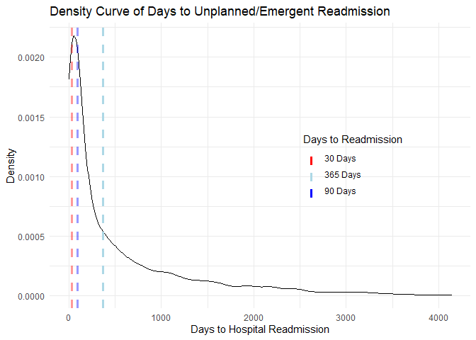<!-- -->


This distribution looks very skewed. I added lines to the 30 and 90 days marks, as I was interested in these benchmarks, but I can't fully assess possible sample size of this group while excluding no readmission (from the above `filter` statement) and from a density curve. Below is a frequency table:  
  

```r
admit_pts %>% mutate(ReadmitCats = 
                       case_when(
                 is.na(TimeToReadmit)  ~ "No readmit",
                 TimeToReadmit >= 350 ~ "Greater than 1 year",
                 TimeToReadmit >= 90 ~ "From 90 to 365 days",
                 TimeToReadmit >= 30 ~ "30-90 days",
                 TRUE ~ "0-30 days"
               )) %>% count(ReadmitCats)
```

```
##           ReadmitCats     n
## 1           0-30 days   975
## 2          30-90 days  1178
## 3 From 90 to 365 days  1322
## 4 Greater than 1 year  2243
## 5          No readmit 32836
```

From the above table, with fairly low frequencies for the 0-30 and 30-90 days ranges alone, I will use readmission with the following calendar year (i.e. next 365 days). Within this chunk, we will also limit the analytic cohort specific to readmission variable. 

I will ensure that the readmit variable `Yr1Readmit` is only calculated for patients who survived out to one year (i.e. `DOD`-`DISCHTIME`$\leq$ 365 days). When examining readmission, we should only include those patients who 1) survived out to one year (regardless of readmission status) and 2) among patients who died, patients who were readmitted within one year prior to their date of death:  
  

```r
admit_pts <- admit_pts %>% mutate(TimeToMort = 
                                    case_when(
                                      DOD!="" ~ as.Date(ymd_hms(DOD)) - as.Date(ymd_hms(DISCHTIME)),
                                      TRUE  ~ 9999
                                      ), 
                                  Yr1Readmit =
                                    case_when(
                                      TimeToMort>365 & TimeToReadmit<=365 ~ 1, 
                                      TimeToMort>365 ~ 0,
                                      TRUE ~ NA_real_
                                      ),
                                  TimeToReadmit_Recalc = # if we do a time-to-event analysis, including this recalculated variable 
                                    case_when(
                                      TimeToReadmit<=365 ~ TimeToReadmit,
                                      TRUE ~ 366
                                      )
                                  ) #%>% select(-ReadmitDate, -TimeToReadmit)
```


### Diagnoses Codes

Now that we have cleaned our patient-level data elements, we can begin working with the diagnosis code data. This will include:  
    1. Removal of V and E diagnoses codes related to health factors and causes of admission respectively outside of morbidity diagnosis
    2. Ensuring the validity of our ICD-9 codes through a definition check and a quick spot-check of gender-specific codes 
    3. Limiting our diagnoses codes to only those that met our prevalence threshold of 1%


#### Imports


```r
icd_raw <- read.csv(here("Data", "Raw", "DIAGNOSES_ICD.csv"), stringsAsFactors = F) %>% select(-ROW_ID)

cat("There are", icd_raw %>% nrow(), "rows in our raw, ICD-9 diagnosis code data.\n")
```

```
## There are 651047 rows in our raw, ICD-9 diagnosis code data.
```

```r
cat("There are", icd_raw %>% distinct(SUBJECT_ID) %>% nrow(), "unique `SUBJECT_ID` values (representign patients) in this data.\n")
```

```
## There are 46520 unique `SUBJECT_ID` values (representign patients) in this data.
```

```r
cat("Lastly, there are", icd_raw %>% distinct(ICD9_CODE) %>% nrow(), "distinct ICD-9 diagnosis codes in this data set.")
```

```
## Lastly, there are 6985 distinct ICD-9 diagnosis codes in this data set.
```

  
##### Removing V & E Codes  

I will first remove any duplicated diagnoses codes within a patient *and* visit. I will also remove the V and E codes which correspond to Health Services/Factors and Causes of Injury/Illness respectively, separate from diagnoses. 


```r
icd_precln <- icd_raw %>% distinct(SUBJECT_ID, HADM_ID, ICD9_CODE, .keep_all = T) %>% 
  filter(substring(ICD9_CODE, 1, 1)!="E" & substring(ICD9_CODE, 1, 1)!="V") #removing V and E codes

icd_precln %>% sample_n(5)
```

```
##   SUBJECT_ID HADM_ID SEQ_NUM ICD9_CODE
## 1      51462  137668      11      7907
## 2      48837  152960      12     32723
## 3      19029  135161      24      7885
## 4      54872  176325       3     51881
## 5      22024  149586      16     29620
```

##### Checking Code Definitions

Using the `icd` package's built-in `is_defined` function, which tests whether a given input value 1) follows valid formatting for an ICD-9 code (5 or less characters, numeric or alphanumeric for V, E codes (which we've excluded)) and 2) is defined using a call to CMS, which keeps a list of what the package refers to as "canonical" ICD-9 codes:


```r
icd_precln %>% mutate(valid = is_defined(ICD9_CODE)) %>% filter(valid==F & ICD9_CODE!="")
```

```
## [1] SUBJECT_ID HADM_ID    SEQ_NUM    ICD9_CODE  valid     
## <0 rows> (or 0-length row.names)
```


##### Gender Code Spot-Check

Although we will note exhaustively examine ICD-9 codes that may be mutually exclusive or gender-specific, we can spot check some large ranges of these codes to re-assure ourselves of the data's validity.

ICD-9 codes ranging from 600 to 608 are specific to males, so we can spot-check to see if any female patients were erroneously diagnosed with these codes:


```r
icd_precln %>% filter(ICD9_CODE>="6000" & ICD9_CODE<"6090") %>% 
  merge(pts_raw, by="SUBJECT_ID") %>% count(GENDER)
```

```
##   GENDER    n
## 1      M 2320
```

And we can perform a similar check using female-specific codes ranging from 614 to 629:


```r
icd_precln %>% filter(ICD9_CODE>="6140" & ICD9_CODE<"6300") %>% 
  merge(pts_raw, by="SUBJECT_ID") %>% count(GENDER)
```

```
##   GENDER   n
## 1      F 577
```

Thankfully our spot checks appear to corroborate the ICD-9 data validity! 


##### Limiting to Our Cohort

We must first limit our ICD data to only those patients/visits of interest for our analysis, which we have thankfully already cleaned and can simply use as a merging "limiter":  


```r
icd_cohort <- admit_pts %>% select(SUBJECT_ID, HADM_ID) %>%  
  merge(icd_precln, by=c("SUBJECT_ID", "HADM_ID"), all.x=T) %>% select(-SEQ_NUM)
```


#### Subsetting by Prevalence

Now we will finalize our diagnosis by subsetting our diagnoses codes to those with a minimum of 1% event rate in our cohort. The relatively large number of unique diagnoses codes contain a number of rare diseases, with extremely low variance. As a result, we will truncate to codes with a sufficiently high proportion or event rate:


```r
icd_1pct <- icd_cohort %>% count(ICD9_CODE) %>% filter(n>(0.01*nrow(admit_pts))) %>% pull(ICD9_CODE)
length(icd_1pct)
```

```
## [1] 178
```

```r
icd_cohort <- icd_cohort %>% mutate(ICD9_CODE = 
                           case_when(
                             ICD9_CODE %in% icd_1pct ~ ICD9_CODE,
                             TRUE ~ NA_character_)
                           ) %>% distinct(SUBJECT_ID, HADM_ID, ICD9_CODE) 
```


### Data Cleaning Concluding Notes

The above data wrangling corresponds to the inclusion, validity-checking, and coding of data for categories to be considered analysis. This data cleaning code does *not* perfectly prepare data for analysis. Treelet dimension reduction will require the calculation and input of a correlation and/or variance-covariance matrix, while modelling or descriptive analysis may require coercion of data elements to/from factors and integers or other coding changes. These small changes, which will change the structure of the data but not the content or information contained therein, are left as *ad hoc* programming done within each relevant analytic section. 


## EDA 

### Diagnosis Code Data 


#### Diagnosis Frequency

We can look broadly at the frequency of all of our diagnoses codes, with the below plot simply arranged in descending order:


```r
icd_cohort %>% count(ICD9_CODE)  %>% arrange(desc(n)) %>% filter(!is.na(ICD9_CODE)) %>%
  ggplot(aes(x=reorder(ICD9_CODE, -n), y=n)) +
    geom_bar(stat="identity", fill="navyblue", alpha=0.65) +
    ggtitle("Frequency Plot of All Diagnoses Codes", 
          subtitle = paste("(Including only codes with 1% prevalence or greater)\nn=", nrow(icd_cohort %>% count(ICD9_CODE)), 
                           " unique diagnoses, among", 
                           nrow(admit_pts), "patients")) + 
    ylab("Frequency") + xlab("Distinct (Unlabelled) ICD-9 Codes") + theme_minimal() +
    theme(axis.text.x=element_blank(), text=element_text(size=13.5))
```

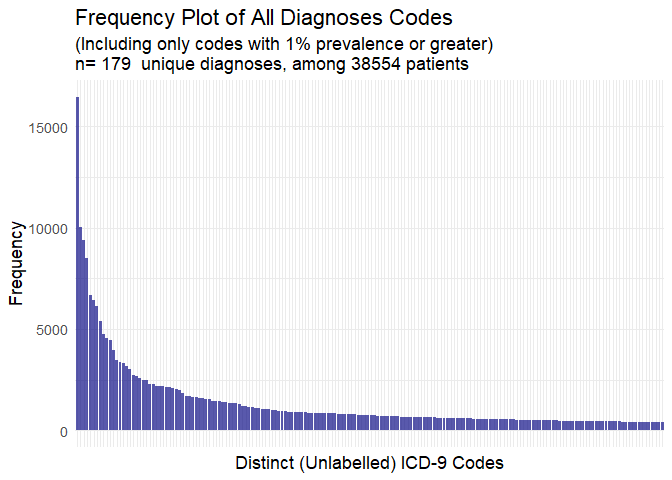<!-- -->


As it is impossible to elucidate much useful information from this visual, due to the volume of data, we can examine simply the most common diagnoses codes, arbitrarily picking the top 15 for legibility of plots:


```r
icd_descr <- read.csv(here("Data", "Raw", "D_ICD_DIAGNOSES.csv"))

# Percentages
icd_cohort %>% count(ICD9_CODE) %>% arrange(desc(n)) %>% filter(!is.na(ICD9_CODE)) %>% 
  merge(icd_descr, by="ICD9_CODE", all.x=T) %>% arrange(desc(n)) %>% ungroup() %>%  filter(row_number()<=15) %>%
  mutate(Prop=n/nrow(icd_cohort %>% distinct(SUBJECT_ID))) %>% select(ICD9_CODE, n, Prop)
```

```
##    ICD9_CODE     n       Prop
## 1       4019 16468 0.42714115
## 2      41401 10035 0.26028428
## 3      42731  9396 0.24371012
## 4       4280  8517 0.22091093
## 5      25000  6673 0.17308191
## 6       2724  6411 0.16628625
## 7       5849  6107 0.15840120
## 8      51881  5385 0.13967422
## 9       2720  4770 0.12372257
## 10      5990  4527 0.11741972
## 11     53081  4466 0.11583753
## 12      2859  3949 0.10242776
## 13      2851  3455 0.08961457
## 14      2449  3364 0.08725424
## 15       486  3335 0.08650205
```

```r
icd_cohort %>% count(ICD9_CODE) %>% arrange(desc(n)) %>% filter(!is.na(ICD9_CODE)) %>% 
  merge(icd_descr, by="ICD9_CODE", all.x=T) %>% arrange(desc(n)) %>% ungroup() %>%  filter(row_number()<=15) %>% 
  ggplot(aes(x=reorder(SHORT_TITLE, -n), y=n)) +
    geom_bar(stat="identity", fill="navyblue", alpha=0.65) +
    ggtitle("Frequency of the 15 Most Common Diagnoses") + 
    ylab("Frequency") + xlab("ICD-9 Code") + theme_minimal() +
    theme(axis.text.x=element_text(angle=60, vjust=0.9, hjust=0.8))
```

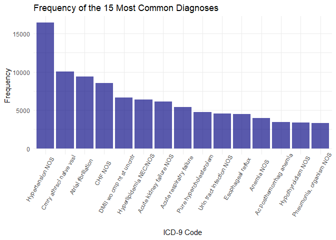<!-- -->

```r
    # this is a really unfortunately x-axis, couldn't find a better angle or adjustment for the x-axis unfortunately 
```

And re-plotting with Thesis-friendly captions:


```r
icd_cohort %>% count(ICD9_CODE)  %>% arrange(desc(n)) %>% filter(!is.na(ICD9_CODE)) %>%
  ggplot(aes(x=reorder(ICD9_CODE, -n), y=n)) +
    geom_bar(stat="identity", fill="navyblue", alpha=0.65) +
    ggtitle("A", #"Frequency Plot of All Diagnoses Codes", 
          # subtitle = paste("(Including only codes with 1% prevalence or greater)\nn=", nrow(icd_cohort %>% count(ICD9_CODE)), 
          #                  " unique diagnoses, among", 
          #                  nrow(admit_pts), "patients")
          ) + 
    ylab("Frequency") + xlab("Distinct (Unlabelled) ICD-9 Codes") + theme_minimal() +
    theme(axis.text.x=element_blank(), text=element_text(size=15))
```

<!-- -->

```r
icd_descr <- read.csv(here("Data", "Raw", "D_ICD_DIAGNOSES.csv"))

icd_cohort %>% count(ICD9_CODE) %>% arrange(desc(n)) %>% filter(!is.na(ICD9_CODE)) %>% 
  merge(icd_descr, by="ICD9_CODE", all.x=T) %>% arrange(desc(n)) %>% ungroup() %>%  filter(row_number()<=15) %>% 
  mutate(Prop = paste0(round(100*n / nrow(icd_cohort %>% distinct(SUBJECT_ID)), 1), '%')) %>% 
  ggplot(aes(x=reorder(SHORT_TITLE, -n), y=n, label=Prop)) +
    geom_bar(stat="identity", fill="navyblue", alpha=0.65) +
    ggtitle("B", #"Frequency of the 15 Most Common Diagnoses"
            ) + 
    ylab("Frequency") + xlab("ICD-9 Code") + theme_minimal() +
    theme(axis.text.x=element_text(angle=60, vjust=0.9, hjust=0.8), text=element_text(size=15)) +
    # geom_text(vjust=1.2, color="white", size=3.31, hjust=0.45)
    geom_text(vjust=-0.9, angle=15) + ylim(c(0, 19000))
```

<!-- -->

```r
    # this is a really unfortunate x-axis, couldn't find a better angle or adjustment for the x-axis 
```


#### Correlation Matrix Among Top Diagnoses

Looking at the correlation matrix of these most common diagnoses codes (as the correlation of diagnoses is what will determine the hierarchy of clustering in the treelet method):  
  

```r
icd_cohort %>% filter(!is.na(ICD9_CODE) & ICD9_CODE %in% (
        icd_cohort %>% count(ICD9_CODE) %>% 
        arrange(desc(n)) %>%
        merge(icd_descr, by="ICD9_CODE", all.x=T) %>% 
        arrange(desc(n)) %>% 
        ungroup() %>%  
        filter(row_number()<=15) %>% pull(ICD9_CODE)
        )) %>%
  mutate(values=1) %>% 
  pivot_wider(id_cols="SUBJECT_ID", names_from="ICD9_CODE", values_from="values") %>% 
  mutate_all(function(x) ifelse(is.na(x), 0, x))  %>% 
  select(-SUBJECT_ID) %>% 
  cor() %>%  
  corrplot::corrplot(type="upper", diag=F, order="hclust", method = "shade")
```

<!-- -->


#### Correlation Matrix Among All Included ($1% \geq$ Prevalence) Codes


```r
x <- (icd_cohort %>% 
  mutate(values=1) %>% 
  pivot_wider(id_cols="SUBJECT_ID", names_from="ICD9_CODE", values_from="values") %>% 
  mutate_all(function(x) ifelse(is.na(x), 0, x))  %>% 
  select(-SUBJECT_ID) %>% 
  cor())

x[x>1] <- 1
x %>% corrplot::corrplot(type="upper", diag=F, order = "hclust", method = "color", tl.pos = "n")
```

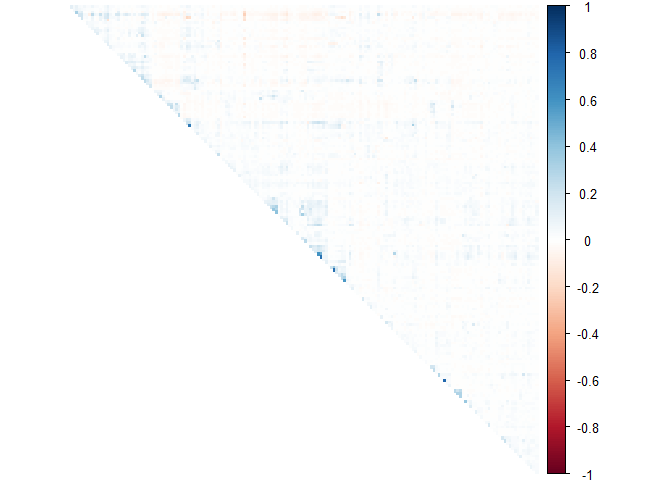<!-- -->


#### Most Correlated Diagnoses
In addition to the `corrplot` package's visualiation of an input correlation matrix, we can use the `corr_cross` package to examine the upper limit of our diagnoses code's correlations. In the plot below, "Correlation %" simply refers to the scaled correlation coefficient (e.g. a "Correlation %" of 89.45% corresponds to a correlation coefficient $\rho=0.8945$):


```r
top10_corr_plot <- icd_cohort %>% 
  filter(!is.na(ICD9_CODE)) %>% 
  mutate(values=1) %>% 
  pivot_wider(id_cols="SUBJECT_ID", names_from="ICD9_CODE", values_from="values") %>% 
  mutate_all(function(x) ifelse(is.na(x), 0, 1)) %>% 
  select(-SUBJECT_ID) %>% 
  corr_cross(top=10, plot=F)
```

```
## Returning only the top 10. You may override with the `top` parameter
```

```r
top10_corr_plot %>% mutate(Pair = paste0(group1, ", ", group2)) %>% 
  ggplot(aes(x=reorder(Pair, corr), y=round(corr, 2))) +
  geom_bar(stat='identity', fill="black", alpha=0.6) + 
  geom_text(aes(y =round(corr, 2)-0.04, label=round(corr, 2)),
            color="white", alpha=0.75) + 
  coord_flip() + theme_minimal() +
  theme(text=element_text(size=13.5)) +
  ylab("Correlation Coefficient") + xlab("ICD-9 Diagnosis Code Pair")
```

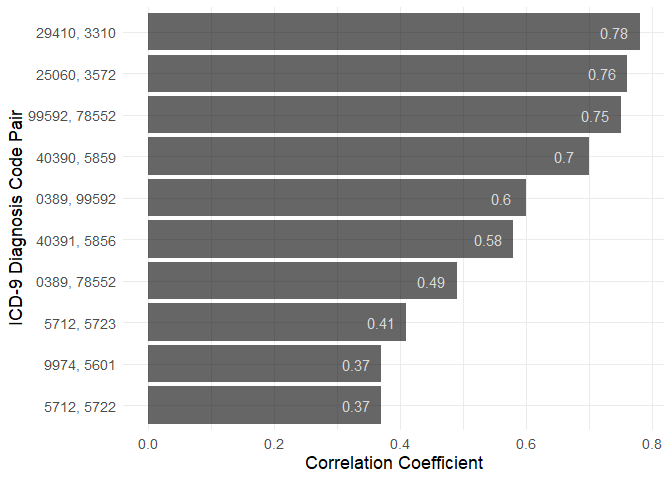<!-- -->
  
  
  
And then examine a matrix-plot of these diagnoses as well:  
  

```r
top_corr_vars <- c(top10_corr_plot %>% mutate(vars=substr(key, 2, nchar(key))) %>% pull(vars), 
                   top10_corr_plot %>% mutate(vars=substr(mix, 2, nchar(mix))) %>% pull(vars)) %>% unique()
                     

icd_cohort %>% 
  filter(!is.na(ICD9_CODE)) %>% 
    mutate(values=1) %>% 
    pivot_wider(id_cols="SUBJECT_ID", names_from="ICD9_CODE", values_from="values") %>% 
    mutate_all(function(x) ifelse(is.na(x), 0, 1)) %>% 
    select(!!!top_corr_vars) %>% cor() %>% 
      corrplot::corrplot(type="upper", diag=F, order="hclust", method = "shade")
```

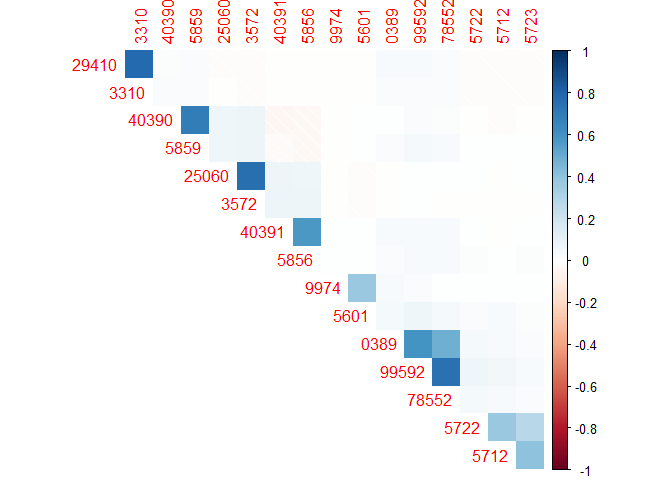<!-- -->


#### Patient Level Data

We can briefly/descriptively examine some of our patient level data, observing frequencies or distributions of our covariates and examining possible relationships of our patient characteristics to mortality, readmission, and hospital length of stay where appropriate. Much of these visualizations were purely exploratory in nature. In instances where data were changed/re-categorized or otherwise altered based on the visualization, I have included comments/annotations. Otherwise, these figures are presented without commentary.

##### Number of Diagnoses


```r
icd_cohort %>% count(SUBJECT_ID) %>% summarise(Mean=quantile(n)[3],
                                               P25=quantile(n)[2],
                                               P75=quantile(n)[4])
```

```
##   Mean P25 P75
## 1    7   5   9
```


##### Mortality 


```r
admit_pts %>% mutate(MortalityType=
                     factor(case_when(
                       InHospMortality==1 ~ "In-Hospital Mortality",
                       TRUE ~ "Survived to Discharge")
                   )) %>% count(MortalityType) %>% mutate(prop=paste0(round(n/nrow(admit_pts), 4)*100, '%')) %>% 
  ggplot(aes(x=reorder(MortalityType, -n), y=n, fill=MortalityType, label=prop)) + 
    geom_text(position = position_dodge(.9),
              vjust = -0.2,
              size = 4) +
  geom_col() + ylab("Frequency") + xlab("Mortality Status") + scale_fill_brewer(palette=2, type = "qual") +
  ggtitle("Frequency of In-Hospital Mortality Status") + theme_minimal() + theme(legend.position = "none") 
```

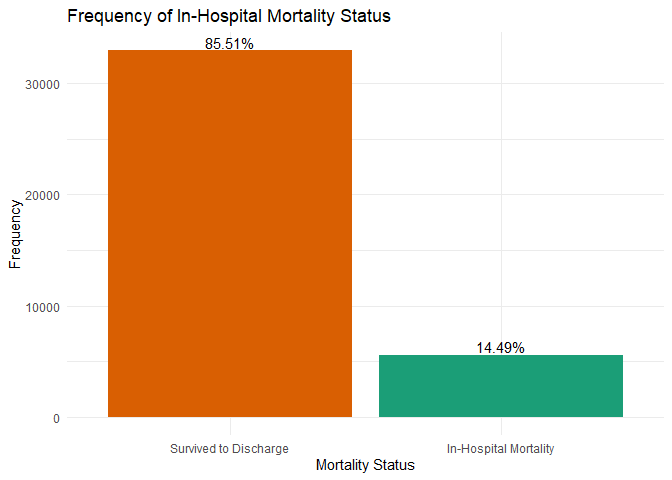<!-- -->


##### Payment/Insurance

```r
admit_pts %>% count(INSURANCE) %>% mutate(prop=paste0(round(n/nrow(admit_pts), 4)*100, '%')) %>% 
  ggplot(aes(x=reorder(INSURANCE, -n), y=n, fill=INSURANCE, label=prop)) + 
    geom_text(position = position_dodge(.9),
              vjust = -0.2,
              size = 4) +
  geom_col() + ylab("Frequency") + xlab("Payment Method") + scale_fill_brewer(palette=2, type = "qual") +
  ggtitle("Frequency of Insurance Status/Payment Method") + theme_minimal() + theme(legend.position = "none") 
```

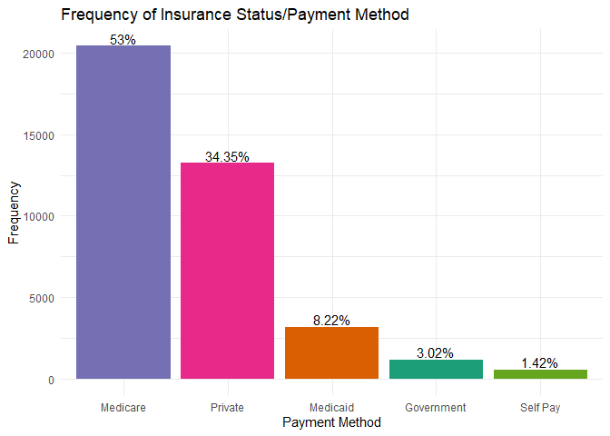<!-- -->

With the two small groups of `Self Pay` and `Government`, I will contradict what I wrote earlier and collapse these categories. `Self Pay` will be collapsed into the `Private` category, and `Government` will be combined with `Medicaid` as `Medicaid/Non-Medicare Public Assistance`:


```r
admit_pts %>% 
  count(INSURANCE) %>% mutate(prop=paste0(round(n/nrow(admit_pts), 4)*100, '%'), 
                                 InsuranceBin =
                                   case_when(
                                     INSURANCE == "Self Pay" | INSURANCE == "Private" ~ "Private/Self-Pay",
                                     INSURANCE=='Medicaid' | INSURANCE == 'Government' ~ 'Medicaid/Public Assistance',
                                     TRUE ~ INSURANCE)) %>% 
  ggplot(aes(x=reorder(InsuranceBin, -n), y=n, fill=reorder(INSURANCE, n), label=prop)) + 
  geom_col() + ylab("Frequency") + xlab("Payment Method") + scale_fill_brewer(palette=2, type = "qual") +
  ggtitle("Frequency of Insurance Status/Payment Method") + theme_minimal() + theme(legend.position = "none") 
```

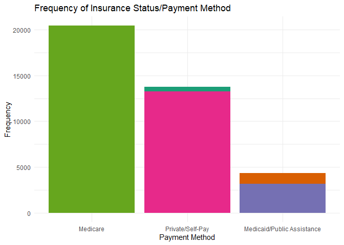<!-- -->


##### General Hospital Length of Stay 


```r
los_graph <- admit_pts %>% 
  mutate(GenLOS=ceiling(difftime(DISCHTIME, ADMITTIME, units = "days") %>% as.numeric())) %>% select(SUBJECT_ID, GenLOS, DISCHTIME, ADMITTIME) # %>% 

# quantile(los_graph$GenLOS)

los_graph %>%   ggplot(aes(x=GenLOS)) + geom_density(fill="lightblue", alpha=0.4) + theme_minimal() +
  xlab("General Hospital Length of Stay") + ylab("Density") + 
  ggtitle("Distribution of General Hospital Length of Stay (Days)") +
  annotate(geom="text", x=150, y=0.05, label=paste0("Length of stay values ranged from 1 to ", max(los_graph$GenLOS), " days.")) +
  annotate(geom="text", x=150, y=0.04, label=paste0("Our length of stay values have a mean of ", round(mean(los_graph$GenLOS), 2), " and variance \n of ",
                                                    round(var(los_graph$GenLOS),2), ", suggesting overdispersion of this variable."))
```

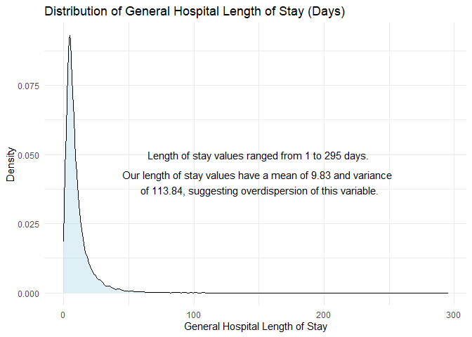<!-- -->

We unsurprisingly see a heavy skew in our length of stay data which is highly overdispersed (variance of 113 is more than ~13x greater than our mean of under 10 days).
 

##### Hospital Re-admission


```r
admit_pts %>% filter(!is.na(Yr1Readmit)) %>% count(Yr1Readmit) %>% mutate(prop=paste0(100*round(n/nrow(admit_pts[!is.na(admit_pts$Yr1Readmit),]), 4), "%")) %>% 
  ggplot(aes(x=reorder(Yr1Readmit, -n), y=n, fill=as.factor(Yr1Readmit), label=prop)) +
  geom_text(position = position_dodge(.9),
              vjust = -0.32,
              size = 4) +
  geom_bar(stat="identity") + ylab("Frequency") + xlab("Unplanned Readmission Within One-Year of Discharge") +
  ggtitle("Frequency of Unplanned Readmission in MIMIC Data") + 
  scale_fill_brewer(palette=2, type = "qual") + theme_minimal() + 
  scale_x_discrete(label= c("No Readmission", "Readmitted")) + theme(legend.position = "none")
```

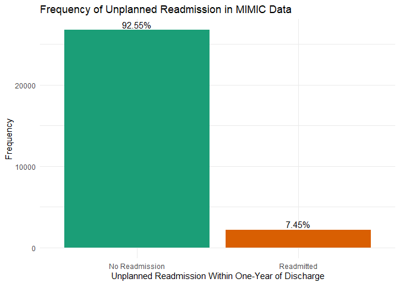<!-- -->


Not only can we look at the simple binary readmission status, we also have time to re-admission, which we previously visualized among all patients but can look at simply within our subset of patients who were readmitted within our single, calendar year of interest:


```r
admit_pts %>% filter(Yr1Readmit==1) %>% 
  ggplot(aes(x=TimeToReadmit_Recalc)) +
  geom_density(fill="white") + theme_minimal() +
  xlab("Days to Hospital Readmission") + ylab("Density") +
  ggtitle("Density Curve of Days to Unplanned/Emergent Readmission") +
  geom_vline(aes(xintercept=30, color="30 Days"), alpha=0.4,  lwd=1.2, lty=2)  +  
  geom_vline(aes(xintercept=90, color="90 Days"), lwd=1.2, lty=2, alpha=0.4,) +
  geom_vline(aes(xintercept=365, color="365 Days"), lwd=1.4, lty=2) +
  scale_color_manual(name="Days to Readmission",
                     values=c(`30 Days`="red", `90 Days`="blue", `365 Days`="lightblue")) +
  theme(legend.position=c(0.72, 0.5), legend.box.margin = margin(6, 6, 6, 6))
```

```
## Don't know how to automatically pick scale for object of type difftime. Defaulting to continuous.
```

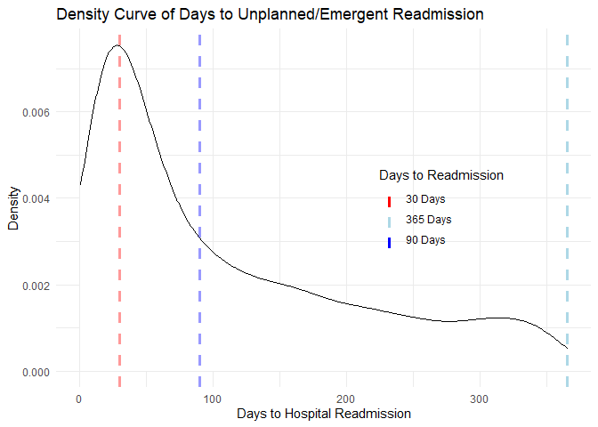<!-- -->


##### Age


```r
# mean(admit_pts$Age)
# sd(admit_pts$Age)
quantile(admit_pts$Age)
```

```
##   0%  25%  50%  75% 100% 
##   18   52   65   78   90
```

```r
admit_pts %>%
  ggplot(aes(x=Age)) +
  geom_density(fill="white") + theme_minimal() +
  xlab("Age") + ylab("Density") +
  ggtitle("Density Curve of Age")
```

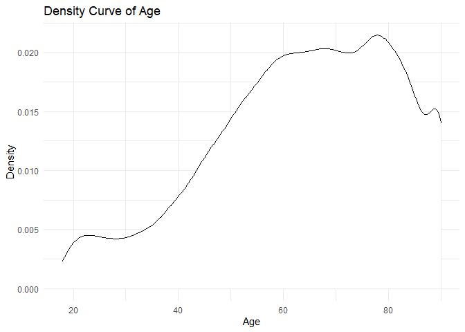<!-- -->


##### Gender


```r
admit_pts %>% count(GENDER) %>% mutate(prop=paste0(100*round(n/nrow(admit_pts), 4), "%")) %>% 
  ggplot(aes(x=reorder(GENDER, -n), y=n, fill=GENDER, label=prop)) +
  geom_text(position = position_dodge(.9),
              vjust = -0.32,
              size = 4) +
  geom_bar(stat="identity") + ylab("Frequency") + xlab("Gender") +
  ggtitle("Frequency of Gender in MIMIC Data") + 
  scale_fill_brewer(palette=2, type = "qual") + theme_minimal()
```

<!-- -->


We have a fairly balanced data set with respect to gender, with men outnumbering women (which we would expect in a data set of critical care admissions).


## Final Data Export

For the exploratory analysis above, the diagnosis data and patient-characteristic data have been contained in separate data frames. Below I pivot the diagnosis data (as previously done when determining the correlation matrix of our diagnosis data) from `icd_cohort` into `icd_wide` and merge the resulting pivoted data frame with the patient characteristics data contained in `admit_pts`. The final dataframe is then titled `cohort_full`. This data frame is used in this file, but I also export it as the standalone cohort and if in the future I would prefer to separate the data cleaning and EDA from the dimension reduction and regression modelling results of my thesis. 


```r
icd_wide <- icd_cohort %>%  
  mutate(values=1) %>% 
  pivot_wider(id_cols="SUBJECT_ID", names_from="ICD9_CODE", values_from="values") %>% 
  mutate_all(function(x) ifelse(is.na(x), 0, x)) %>% select(-`NA`)

cohort_full <- merge(icd_wide, admit_pts, by="SUBJECT_ID")

colnames(cohort_full)[c(grep("[0-9]$", colnames(cohort_full)))] <- paste0("X", colnames(cohort_full)[c(grep("[0-9]$", colnames(cohort_full)))])

write.csv(cohort_full,
          here("Data", "cohort_full.csv"),
          row.names = F)
```


## Appendixes 


```r
require(magrittr) # Ceci n'est pas une %>% 
require(dplyr) # General data management, cleaning (admittedly I switch between Base R and tidyverse as I code, somewhat stream-of-consciousness ly)
require(ggplot2) # Visualization
require(comorbidity) # Used to easily generate Elixhauser comorbdity grouping/categorization [8/23/2020 Note: may be excluded if Elixhauser or Charlson not used]
require(tidyr) # pivot functions for transposing data to/from long and wide
require(icd) # used in validity check of diagnoses codes
require(lubridate) # used in evaluating dates, most notably in date of death 
require(lares) # corr_cross function used to identify the top correlations within a data frame/design matrix
require(corrplot) # used for visualizing correlation matrices 
require(here) # Used for data-calls/ease of file path storage usage
require(treelet) # for treelet modelling
require(ggdendro) # trying ggplot's dnedrogram extension

if(!("cohort_full" %in% ls())) {
  cohort_full <-  read.csv(here("Data", "cohort_full.csv"))
}
```


### Appendix A: Thesis Table & Figure Generation

Redundant code from the main body of cleaning and EDA code, but I wanted to consolidate relevant table & figure genereation code. This is not an exhaustive list of tables & figures, including only those captured in the descriptive analyses (Results 3.1).

#### Table 2A & 2B: Cohort Descriptives


```r
stat_sum <- function(data, var, stat, category=NULL) {
  quovar <- deparse(substitute(var))
  if(stat=="mean") output_txt <- paste0(mean(data[,quovar]) %>% round(2), " (", sd(data[,quovar]) %>% round(2), ")")
  if(stat=="median") output_txt <- paste0(median(data[,quovar]) %>% round(2), " [", quantile(data[,quovar])[2] %>% round(2), "-", quantile(data[,quovar])[4] %>% round(2), "]")
  if(stat=="proportion" | stat=="prop") {
    if(is.null(category)) stop("When requesting proportion for categorical vaiablevariable, please specify ")
    freq <- data[data[,quovar]==category & !is.na(data[,quovar]),] %>% nrow()
    prop <- (100*(data[data[,quovar]==category & !is.na(data[,quovar]),] %>% nrow()) / nrow(data[!is.na(data[,quovar]),])) %>% round(2)
    output_txt <- paste0(freq, " (", prop, "%)")
  }
  return(output_txt)
}

## 1A: Mortality & LOS Cohort (n=38,554)
  # Calculating number of ICD-9-CM Diagnosis Codes per patient (Median [IQR]) before table
    icd_quantiles <- icd_cohort %>% count(SUBJECT_ID) %>% pull(n) %>% quantile()
    
  # Generating the table in an easy copy/paste format
    (sumtbl <- cohort_full %>% summarize(
      # `Age, Mean (SD)` = paste0(round(mean(Age), 2), " (", round(sd(Age),2), ")"),
      # `Sex (Male), n (%)` = paste0(sum(cohort_full$GENDER=="M"), " (", round(100*sum(cohort_full$GENDER=="M")/nrow(cohort_full), 2), "%)"),
      # `Hospital Stay (days), Median (IQR)` = paste0(median(HospitalLOS), " [", quantile(HospitalLOS)[2], "-", quantile(HospitalLOS)[4], "]"),
      `Age, Mean (SD)` = stat_sum(data=., var=Age, stat="mean"),
      `Sex (Male), n (%)` = stat_sum(data=., var=GENDER, stat="prop", category = "M"),
      `Hospital Stay (days), Median (IQR)` = stat_sum(., var=HospitalLOS, stat="median"),
      `Re-Admission*, n (%)`= "",
      `In-Hospital Mortality, n (%)` = stat_sum(., InHospMortality, "prop", 1),
      `Number of ICD-9-CM Diagnosis Codes per Patient, Median (IQR)` = paste0(icd_quantiles[3], " [", icd_quantiles[2], "-", icd_quantiles[4], "]"),
      `Primary Payment Method, n (%)` = "",
      `Medicare` = stat_sum(., INSURANCE, "prop", "Medicare"),
      `Private Insurance` = stat_sum(., INSURANCE, "prop", "Private"),
      `Self-Pay` = stat_sum(., INSURANCE, "prop", "Self Pay"),
      `Medicaid` = stat_sum(., INSURANCE, "prop", "Medicaid"),
      `Other Public Assistance` = stat_sum(., INSURANCE, "prop", "Government")
    )) 
```

```
##   Age, Mean (SD) Sex (Male), n (%) Hospital Stay (days), Median (IQR)
## 1  63.51 (17.55)     21820 (56.6%)                           7 [4-12]
##   Re-Admission*, n (%) In-Hospital Mortality, n (%)
## 1                                     5586 (14.49%)
##   Number of ICD-9-CM Diagnosis Codes per Patient, Median (IQR)
## 1                                                      7 [5-9]
##   Primary Payment Method, n (%)    Medicare Private Insurance    Self-Pay
## 1                               20433 (53%)    13243 (34.35%) 546 (1.42%)
##       Medicaid Other Public Assistance
## 1 3169 (8.22%)            1163 (3.02%)
```

```r
    data.frame(colnames(sumtbl),
               t(sumtbl[1,]),
               row.names = NULL) %>% write.table("clipboard")
    


## 1B: Reamdission Cohort (n=28,893)
    readmit_cohort <- cohort_full %>% filter(!is.na(Yr1Readmit))
    
    readmit_icds <- icd_cohort %>% filter(SUBJECT_ID %in% (readmit_cohort %>% pull(SUBJECT_ID)))
    readmit_quantiles <- readmit_icds %>% count(SUBJECT_ID) %>% pull(n) %>% quantile()
 
       
    (sumtbl_readmit <- readmit_cohort %>% summarize(
      # `Age, Mean (SD)` = paste0(round(mean(Age), 2), " (", round(sd(Age),2), ")"),
      # `Sex (Male), n (%)` = paste0(sum(cohort_full$GENDER=="M"), " (", round(100*sum(cohort_full$GENDER=="M")/nrow(cohort_full), 2), "%)"),
      # `Hospital Stay (days), Median (IQR)` = paste0(median(HospitalLOS), " [", quantile(HospitalLOS)[2], "-", quantile(HospitalLOS)[4], "]"),
      `Age, Mean (SD)` = stat_sum(data=., var=Age, stat="mean"),
      `Sex (Male), n (%)` = stat_sum(data=., var=GENDER, stat="prop", category = "M"),
      `Hospital Stay (days), Median (IQR)` = stat_sum(., var=HospitalLOS, stat="median"),
      `Re-Admission*, n (%)`= stat_sum(., Yr1Readmit, "prop", 1),
      `In-Hospital Mortality, n (%)` = stat_sum(., InHospMortality, "prop", 1),
      `Number of ICD-9-CM Diagnosis Codes per Patient, Median (IQR)` = paste0(readmit_quantiles[3], " [", readmit_quantiles[2], "-", readmit_quantiles[4], "]"),
      `Primary Payment Method, n (%)` = "",
      `Medicare` = stat_sum(., INSURANCE, "prop", "Medicare"),
      `Private Insurance` = stat_sum(., INSURANCE, "prop", "Private"),
      `Self-Pay` = stat_sum(., INSURANCE, "prop", "Self Pay"),
      `Medicaid` = stat_sum(., INSURANCE, "prop", "Medicaid"),
      `Other Public Assistance` = stat_sum(., INSURANCE, "prop", "Government")
    )) 
```

```
##   Age, Mean (SD) Sex (Male), n (%) Hospital Stay (days), Median (IQR)
## 1  60.92 (17.58)    16663 (57.67%)                           7 [4-11]
##   Re-Admission*, n (%) In-Hospital Mortality, n (%)
## 1         2153 (7.45%)                       0 (0%)
##   Number of ICD-9-CM Diagnosis Codes per Patient, Median (IQR)
## 1                                                      6 [4-9]
##   Primary Payment Method, n (%)       Medicare Private Insurance    Self-Pay
## 1                               13633 (47.18%)    11209 (38.79%) 440 (1.52%)
##       Medicaid Other Public Assistance
## 1 2584 (8.94%)            1027 (3.55%)
```

```r
# All results combined    
data.frame(colnames(sumtbl),
       t(sumtbl[1,]),
       t(sumtbl_readmit[1,]),
       row.names = NULL) %>% write.table("clipboard")
```


#### Figure 1A & 1B: Diagnosis Code Frequency

```r
icd_cohort %>% count(ICD9_CODE)  %>% arrange(desc(n)) %>% filter(!is.na(ICD9_CODE)) %>%
  ggplot(aes(x=reorder(ICD9_CODE, -n), y=n)) +
    geom_bar(stat="identity", fill="navyblue", alpha=0.65) +
    ggtitle("A", #"Frequency Plot of All Diagnoses Codes", 
          # subtitle = paste("(Including only codes with 1% prevalence or greater)\nn=", nrow(icd_cohort %>% count(ICD9_CODE)), 
          #                  " unique diagnoses, among", 
          #                  nrow(admit_pts), "patients")
          ) + 
    ylab("Frequency") + xlab("Distinct (Unlabelled) ICD-9 Codes") + theme_minimal() +
    theme(axis.text.x=element_blank(), text=element_text(size=15))
```

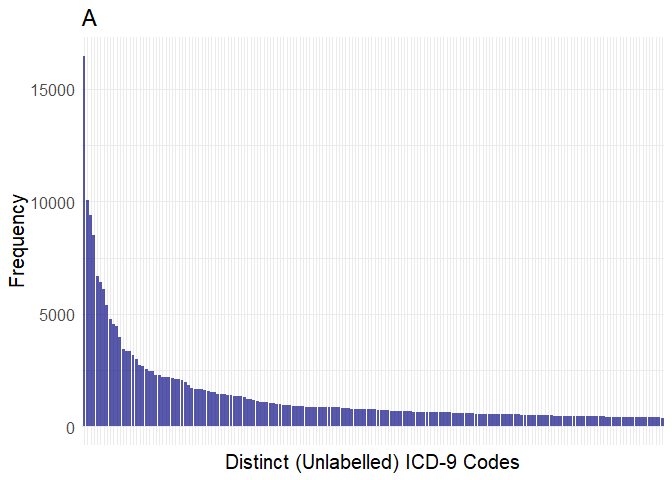<!-- -->

```r
icd_descr <- read.csv(here("Data", "Raw", "D_ICD_DIAGNOSES.csv"))

icd_cohort %>% count(ICD9_CODE) %>% arrange(desc(n)) %>% filter(!is.na(ICD9_CODE)) %>% 
  merge(icd_descr, by="ICD9_CODE", all.x=T) %>% arrange(desc(n)) %>% ungroup() %>%  filter(row_number()<=15) %>% 
  mutate(Prop = paste0(round(100*n / nrow(icd_cohort %>% distinct(SUBJECT_ID)), 1), '%')) %>% 
  ggplot(aes(x=reorder(SHORT_TITLE, -n), y=n, label=Prop)) +
    geom_bar(stat="identity", fill="navyblue", alpha=0.65) +
    ggtitle("B", #"Frequency of the 15 Most Common Diagnoses"
            ) + 
    ylab("Frequency") + xlab("ICD-9 Code") + theme_minimal() +
    theme(axis.text.x=element_text(angle=60, vjust=0.9, hjust=0.8), text=element_text(size=15)) +
    # geom_text(vjust=1.2, color="white", size=3.31, hjust=0.45)
    geom_text(vjust=-0.9, angle=15) + ylim(c(0, 19000))
```

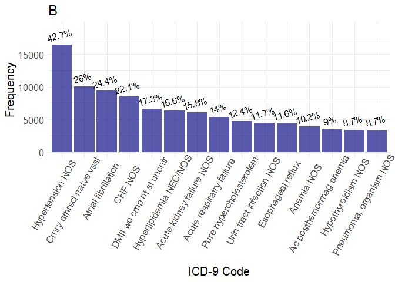<!-- -->

```r
    # this is a really unfortunate x-axis, couldn't find a better angle or adjustment for the x-axis 
```

#### Figure 3: Correlation Matrix

```r
cormat <- (icd_cohort %>% 
  mutate(values=1) %>% 
  pivot_wider(id_cols="SUBJECT_ID", names_from="ICD9_CODE", values_from="values") %>% 
  mutate_all(function(x) ifelse(is.na(x), 0, x))  %>% 
  select(-SUBJECT_ID) %>% 
  cor())

cormat %>% corrplot::corrplot(type="upper", diag=F, order = "hclust", col = colorRampPalette(c("red","white", "blue"))(10), method = "color", tl.pos = "n")
```

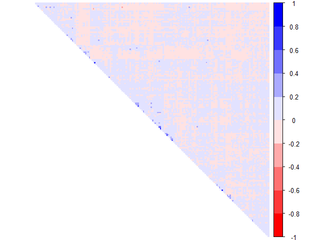<!-- -->


#### Figure 4: Highest Correlation Bar Graph

```r
top10_corr_plot <- icd_cohort %>% 
  filter(!is.na(ICD9_CODE)) %>% 
  mutate(values=1) %>% 
  pivot_wider(id_cols="SUBJECT_ID", names_from="ICD9_CODE", values_from="values") %>% 
  mutate_all(function(x) ifelse(is.na(x), 0, 1)) %>% 
  select(-SUBJECT_ID) %>% 
  corr_cross(top=10, plot=F)
```

```
## Returning only the top 10. You may override with the `top` parameter
```

```r
top10_corr_plot <- top10_corr_plot %>%  mutate(group1 = 
                             paste0(substr(group1, 0, 3), ".", substr(group1, 4, nchar(group1))),
                           group2 = 
                             paste0(substr(group2, 0, 3), ".", substr(group2, 4, nchar(group2))))

barplot <- top10_corr_plot %>% mutate(Pair = paste0(group1, ", ", group2)) %>% 
  ggplot(aes(x=reorder(Pair, corr), y=round(corr, 2))) +
  geom_bar(stat='identity', fill="black", alpha=0.6) + 
  geom_text(aes(y =round(corr, 2)-0.04, label=round(corr, 2)),
            color="white", alpha=0.75) + 
  coord_flip() + theme_minimal() +
  theme(text=element_text(size=13.5)) +
  ylab("Correlation Coefficient") + xlab("ICD-9 Diagnosis Code Pair")

require(gridExtra)
```

```
## Loading required package: gridExtra
```

```
## 
## Attaching package: 'gridExtra'
```

```
## The following object is masked from 'package:dplyr':
## 
##     combine
```

```r
require(grid)
```

```
## Loading required package: grid
```

```r
corrtbl <- c(top10_corr_plot %>% pull(group1) %>% unique(),
             t(t(top10_corr_plot %>% pull(group2) %>% unique()))) %>% unique() %>% data.frame(ICD9_CODE=.) %>%
  merge(icd_descr %>% select(ICD9_CODE, SHORT_TITLE) %>% 
          mutate(ICD9_CODE = paste0(substr(ICD9_CODE, 0, 3), ".", substr(ICD9_CODE, 4, nchar(ICD9_CODE)))), by="ICD9_CODE", all.x=T) %>% arrange(ICD9_CODE) %>% 
  mutate(SHORT_TITLE = case_when(is.na(SHORT_TITLE) ~ "Digestive system complications NOS",
                                 ICD9_CODE=="250.60" ~  "Diabetes (II) with neurological manifestations", 
                                 ICD9_CODE=="294.10" ~  "Dementia without behavioral disturbance",
                                 ICD9_CODE=="403.90" ~  "Hypertensive chronic kidney disease, stage I-IV",
                                 ICD9_CODE=="403.91" ~  "Hypertensive chronic kidney disease, stage V+",
                                 ICD9_CODE=="585.9" ~  "Chronic kidney disease NOS",
                                 TRUE ~ SHORT_TITLE)) %>% select(`ICD-9-CM Code`=ICD9_CODE, `Description`=SHORT_TITLE)  %>% tableGrob(rows = NULL)


grid.arrange(barplot,
             corrtbl,
             nrow=1,
             as.table=T)
```

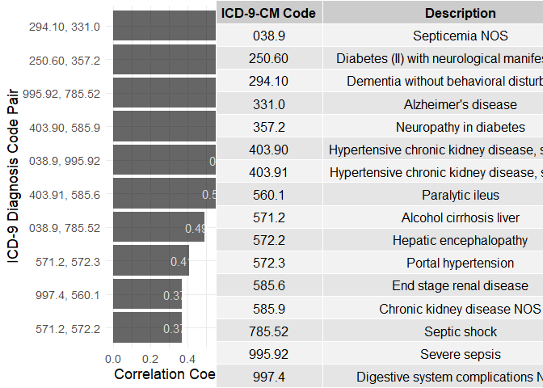<!-- -->


### Appendix B: Unused Exporatory Analyses

My lazy calling of packages and data, so that analysis does not require running all cleaning and EDA code above:

#### Precursor Dimension Reduction

Prior to the treelet cross-validation process, Dr. Carlson suggested fitting PCA to evaluate a possible range of values for the $K$ number of clusters parameter to fit in the treelet cross-validation process. I thought it may be interesting to similarly do some (similarly preliminary) agglomerative hierarchical clustering to the data. 

#### PCA Precursor 


```r
icd_pca <- cohort_full %>% select(starts_with("X")) %>% prcomp(center=T, scale=T)

icd_pca_df <- data.frame(PC = 1:178,
                         Var = icd_pca$sdev^2) %>% 
              mutate(PropVar = Var / nrow(.),
                     CmltvPropVar = cumsum(PropVar))

icd_pca_df %>% ggplot(aes(x=PC, y=PropVar)) +
  geom_point(size=5, alpha=0.4) + geom_line(lwd=0.75) + theme_minimal() +
  ylab("Proportion of Variance Explained") + xlab("Principal Component") +
  ggtitle("Proportion of Variance Explained by Individual Principal Component")
```

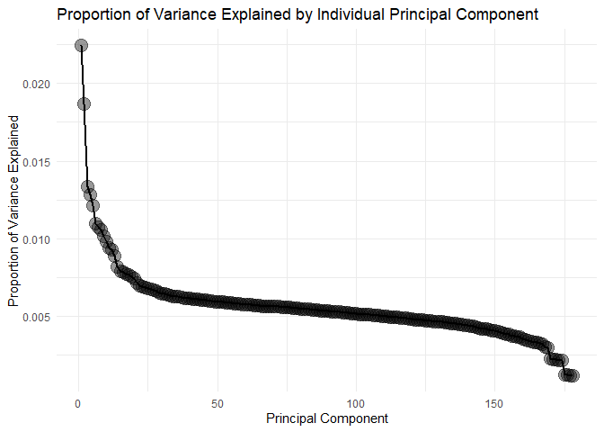<!-- -->

```r
icd_pca_df %>% ggplot(aes(x=PC, y=CmltvPropVar)) +
  geom_point(size=5, alpha=0.4) + geom_line(lwd=0.75) + theme_minimal() +
  ylab("Cumulative Proportion of Variance Explained") + xlab("Principal Component") +
  ggtitle("Cumulative Proportion of Variance Explained by Principal Component")
```

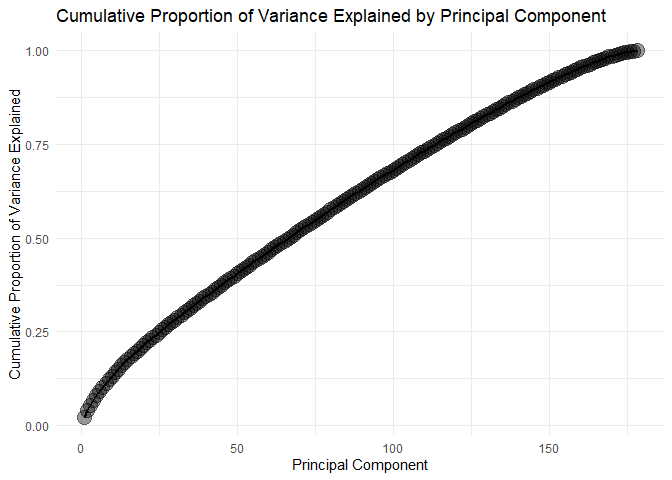<!-- -->


#### Preliminary Treelet


Full dendrogram of our treelet, not particularly useful/insightful but thanfully it is simple and quick to fit our treelet, retaining results for all levels

```r
# compute correlation matrix
icd_cor <- cohort_full %>% select(starts_with("X")) %>% cor()

# run treelet
tt_results <- treelet::Run_JTree(icd_cor, nrow(icd_cor)-1, 1:nrow(icd_cor)-1)
```

```
## [1] 100
```


#### Treelet Identification


```r
tt_results %>% str()
```

```
## List of 6
##  $ basis    :List of 177
##   ..$ : num [1:178, 1:178] 1 0 0 0 0 0 0 0 0 0 ...
##   ..$ : num [1:178, 1:178] 1 0 0 0 0 0 0 0 0 0 ...
##   ..$ : num [1:178, 1:178] 1 0 0 0 0 0 0 0 0 0 ...
##   ..$ : num [1:178, 1:178] 1 0 0 0 0 0 0 0 0 0 ...
##   ..$ : num [1:178, 1:178] 1 0 0 0 0 0 0 0 0 0 ...
##   ..$ : num [1:178, 1:178] 1 0 0 0 0 0 0 0 0 0 ...
##   ..$ : num [1:178, 1:178] 1 0 0 0 0 0 0 0 0 0 ...
##   ..$ : num [1:178, 1:178] 1 0 0 0 0 0 0 0 0 0 ...
##   ..$ : num [1:178, 1:178] 1 0 0 0 0 0 0 0 0 0 ...
##   ..$ : num [1:178, 1:178] 1 0 0 0 0 0 0 0 0 0 ...
##   ..$ : num [1:178, 1:178] 1 0 0 0 0 0 0 0 0 0 ...
##   ..$ : num [1:178, 1:178] 1 0 0 0 0 0 0 0 0 0 ...
##   ..$ : num [1:178, 1:178] 1 0 0 0 0 0 0 0 0 0 ...
##   ..$ : num [1:178, 1:178] 1 0 0 0 0 0 0 0 0 0 ...
##   ..$ : num [1:178, 1:178] 1 0 0 0 0 0 0 0 0 0 ...
##   ..$ : num [1:178, 1:178] 1 0 0 0 0 0 0 0 0 0 ...
##   ..$ : num [1:178, 1:178] 1 0 0 0 0 0 0 0 0 0 ...
##   ..$ : num [1:178, 1:178] 1 0 0 0 0 0 0 0 0 0 ...
##   ..$ : num [1:178, 1:178] 1 0 0 0 0 0 0 0 0 0 ...
##   ..$ : num [1:178, 1:178] 1 0 0 0 0 0 0 0 0 0 ...
##   ..$ : num [1:178, 1:178] 1 0 0 0 0 0 0 0 0 0 ...
##   ..$ : num [1:178, 1:178] 1 0 0 0 0 0 0 0 0 0 ...
##   ..$ : num [1:178, 1:178] 1 0 0 0 0 0 0 0 0 0 ...
##   ..$ : num [1:178, 1:178] 1 0 0 0 0 0 0 0 0 0 ...
##   ..$ : num [1:178, 1:178] 1 0 0 0 0 0 0 0 0 0 ...
##   ..$ : num [1:178, 1:178] 1 0 0 0 0 0 0 0 0 0 ...
##   ..$ : num [1:178, 1:178] 1 0 0 0 0 0 0 0 0 0 ...
##   ..$ : num [1:178, 1:178] 1 0 0 0 0 0 0 0 0 0 ...
##   ..$ : num [1:178, 1:178] 1 0 0 0 0 0 0 0 0 0 ...
##   ..$ : num [1:178, 1:178] 1 0 0 0 0 0 0 0 0 0 ...
##   ..$ : num [1:178, 1:178] 1 0 0 0 0 0 0 0 0 0 ...
##   ..$ : num [1:178, 1:178] 1 0 0 0 0 0 0 0 0 0 ...
##   ..$ : num [1:178, 1:178] 1 0 0 0 0 0 0 0 0 0 ...
##   ..$ : num [1:178, 1:178] 1 0 0 0 0 0 0 0 0 0 ...
##   ..$ : num [1:178, 1:178] 1 0 0 0 0 0 0 0 0 0 ...
##   ..$ : num [1:178, 1:178] 1 0 0 0 0 0 0 0 0 0 ...
##   ..$ : num [1:178, 1:178] 1 0 0 0 0 0 0 0 0 0 ...
##   ..$ : num [1:178, 1:178] 1 0 0 0 0 0 0 0 0 0 ...
##   ..$ : num [1:178, 1:178] 1 0 0 0 0 0 0 0 0 0 ...
##   ..$ : num [1:178, 1:178] 1 0 0 0 0 0 0 0 0 0 ...
##   ..$ : num [1:178, 1:178] 1 0 0 0 0 0 0 0 0 0 ...
##   ..$ : num [1:178, 1:178] 1 0 0 0 0 0 0 0 0 0 ...
##   ..$ : num [1:178, 1:178] 1 0 0 0 0 0 0 0 0 0 ...
##   ..$ : num [1:178, 1:178] 1 0 0 0 0 0 0 0 0 0 ...
##   ..$ : num [1:178, 1:178] 1 0 0 0 0 0 0 0 0 0 ...
##   ..$ : num [1:178, 1:178] 1 0 0 0 0 0 0 0 0 0 ...
##   ..$ : num [1:178, 1:178] 1 0 0 0 0 0 0 0 0 0 ...
##   ..$ : num [1:178, 1:178] 1 0 0 0 0 0 0 0 0 0 ...
##   ..$ : num [1:178, 1:178] 1 0 0 0 0 0 0 0 0 0 ...
##   ..$ : num [1:178, 1:178] 1 0 0 0 0 0 0 0 0 0 ...
##   ..$ : num [1:178, 1:178] 1 0 0 0 0 0 0 0 0 0 ...
##   ..$ : num [1:178, 1:178] 1 0 0 0 0 0 0 0 0 0 ...
##   ..$ : num [1:178, 1:178] 1 0 0 0 0 0 0 0 0 0 ...
##   ..$ : num [1:178, 1:178] 1 0 0 0 0 0 0 0 0 0 ...
##   ..$ : num [1:178, 1:178] 1 0 0 0 0 0 0 0 0 0 ...
##   ..$ : num [1:178, 1:178] 1 0 0 0 0 0 0 0 0 0 ...
##   ..$ : num [1:178, 1:178] 1 0 0 0 0 0 0 0 0 0 ...
##   ..$ : num [1:178, 1:178] 1 0 0 0 0 0 0 0 0 0 ...
##   ..$ : num [1:178, 1:178] 1 0 0 0 0 0 0 0 0 0 ...
##   ..$ : num [1:178, 1:178] 1 0 0 0 0 0 0 0 0 0 ...
##   ..$ : num [1:178, 1:178] 1 0 0 0 0 0 0 0 0 0 ...
##   ..$ : num [1:178, 1:178] 1 0 0 0 0 0 0 0 0 0 ...
##   ..$ : num [1:178, 1:178] 1 0 0 0 0 0 0 0 0 0 ...
##   ..$ : num [1:178, 1:178] 1 0 0 0 0 0 0 0 0 0 ...
##   ..$ : num [1:178, 1:178] 1 0 0 0 0 0 0 0 0 0 ...
##   ..$ : num [1:178, 1:178] 1 0 0 0 0 0 0 0 0 0 ...
##   ..$ : num [1:178, 1:178] 1 0 0 0 0 0 0 0 0 0 ...
##   ..$ : num [1:178, 1:178] 1 0 0 0 0 0 0 0 0 0 ...
##   ..$ : num [1:178, 1:178] 1 0 0 0 0 0 0 0 0 0 ...
##   ..$ : num [1:178, 1:178] 1 0 0 0 0 0 0 0 0 0 ...
##   ..$ : num [1:178, 1:178] 1 0 0 0 0 0 0 0 0 0 ...
##   ..$ : num [1:178, 1:178] 1 0 0 0 0 0 0 0 0 0 ...
##   ..$ : num [1:178, 1:178] 1 0 0 0 0 0 0 0 0 0 ...
##   ..$ : num [1:178, 1:178] 1 0 0 0 0 0 0 0 0 0 ...
##   ..$ : num [1:178, 1:178] 1 0 0 0 0 0 0 0 0 0 ...
##   ..$ : num [1:178, 1:178] 1 0 0 0 0 0 0 0 0 0 ...
##   ..$ : num [1:178, 1:178] 1 0 0 0 0 0 0 0 0 0 ...
##   ..$ : num [1:178, 1:178] 1 0 0 0 0 0 0 0 0 0 ...
##   ..$ : num [1:178, 1:178] 1 0 0 0 0 0 0 0 0 0 ...
##   ..$ : num [1:178, 1:178] 1 0 0 0 0 0 0 0 0 0 ...
##   ..$ : num [1:178, 1:178] 1 0 0 0 0 0 0 0 0 0 ...
##   ..$ : num [1:178, 1:178] 1 0 0 0 0 0 0 0 0 0 ...
##   ..$ : num [1:178, 1:178] 1 0 0 0 0 0 0 0 0 0 ...
##   ..$ : num [1:178, 1:178] 1 0 0 0 0 0 0 0 0 0 ...
##   ..$ : num [1:178, 1:178] 0.993 0 0 0 -0.0265 ...
##   ..$ : num [1:178, 1:178] 0.993 0 0 0 -0.0265 ...
##   ..$ : num [1:178, 1:178] 0.993 0 0 0 -0.0265 ...
##   ..$ : num [1:178, 1:178] 0.993 0 0 0 -0.0265 ...
##   ..$ : num [1:178, 1:178] 0.993 0 0 0 -0.0265 ...
##   ..$ : num [1:178, 1:178] 0.993 0 0 0 -0.0265 ...
##   ..$ : num [1:178, 1:178] 0.993 0 0 0 -0.0265 ...
##   ..$ : num [1:178, 1:178] 0.993 0 0 0 -0.0265 ...
##   ..$ : num [1:178, 1:178] 0.993 0 0 0 -0.0265 ...
##   ..$ : num [1:178, 1:178] 0.993 0 0 0 -0.0265 ...
##   ..$ : num [1:178, 1:178] 0.993 0 0 0 -0.0265 ...
##   ..$ : num [1:178, 1:178] 0.993 0 0 0 -0.0265 ...
##   ..$ : num [1:178, 1:178] 0.993 0 0 0 -0.0265 ...
##   ..$ : num [1:178, 1:178] 0.993 0 0 0 -0.0265 ...
##   ..$ : num [1:178, 1:178] 0.993 0 0 0 -0.0265 ...
##   .. [list output truncated]
##  $ Zpos     : num [1:177, 1:2] 144 115 61 78 7 15 80 80 62 80 ...
##  $ T        :List of 177
##   ..$ : num [1:2, 1:2] 0.707 0.707 -0.707 0.707
##   ..$ : num [1:2, 1:2] 0.707 0.707 -0.707 0.707
##   ..$ : num [1:2, 1:2] 0.707 0.707 -0.707 0.707
##   ..$ : num [1:2, 1:2] 0.707 0.707 -0.707 0.707
##   ..$ : num [1:2, 1:2] 0.848 -0.53 0.53 0.848
##   ..$ : num [1:2, 1:2] 0.707 0.707 -0.707 0.707
##   ..$ : num [1:2, 1:2] 0.707 0.707 -0.707 0.707
##   ..$ : num [1:2, 1:2] 0.838 0.545 -0.545 0.838
##   ..$ : num [1:2, 1:2] 0.707 0.707 -0.707 0.707
##   ..$ : num [1:2, 1:2] 0.897 0.442 -0.442 0.897
##   ..$ : num [1:2, 1:2] 0.707 0.707 -0.707 0.707
##   ..$ : num [1:2, 1:2] 0.892 0.451 -0.451 0.892
##   ..$ : num [1:2, 1:2] 0.707 0.707 -0.707 0.707
##   ..$ : num [1:2, 1:2] 0.818 0.576 -0.576 0.818
##   ..$ : num [1:2, 1:2] 0.892 -0.452 0.452 0.892
##   ..$ : num [1:2, 1:2] 0.917 0.399 -0.399 0.917
##   ..$ : num [1:2, 1:2] 0.707 0.707 -0.707 0.707
##   ..$ : num [1:2, 1:2] 0.707 0.707 -0.707 0.707
##   ..$ : num [1:2, 1:2] 0.707 0.707 -0.707 0.707
##   ..$ : num [1:2, 1:2] 0.943 -0.333 0.333 0.943
##   ..$ : num [1:2, 1:2] 0.707 0.707 -0.707 0.707
##   ..$ : num [1:2, 1:2] 0.959 0.283 -0.283 0.959
##   ..$ : num [1:2, 1:2] 0.936 0.352 -0.352 0.936
##   ..$ : num [1:2, 1:2] 0.707 0.707 -0.707 0.707
##   ..$ : num [1:2, 1:2] 0.707 0.707 -0.707 0.707
##   ..$ : num [1:2, 1:2] 0.834 -0.552 0.552 0.834
##   ..$ : num [1:2, 1:2] 0.707 0.707 -0.707 0.707
##   ..$ : num [1:2, 1:2] 0.842 0.539 -0.539 0.842
##   ..$ : num [1:2, 1:2] 0.97 -0.244 0.244 0.97
##   ..$ : num [1:2, 1:2] 0.707 0.707 -0.707 0.707
##   ..$ : num [1:2, 1:2] 0.707 0.707 -0.707 0.707
##   ..$ : num [1:2, 1:2] 0.956 0.294 -0.294 0.956
##   ..$ : num [1:2, 1:2] 0.974 0.226 -0.226 0.974
##   ..$ : num [1:2, 1:2] 0.795 0.606 -0.606 0.795
##   ..$ : num [1:2, 1:2] 0.707 0.707 -0.707 0.707
##   ..$ : num [1:2, 1:2] 0.854 0.521 -0.521 0.854
##   ..$ : num [1:2, 1:2] 0.969 0.247 -0.247 0.969
##   ..$ : num [1:2, 1:2] 0.887 0.461 -0.461 0.887
##   ..$ : num [1:2, 1:2] 0.904 -0.427 0.427 0.904
##   ..$ : num [1:2, 1:2] 0.904 0.428 -0.428 0.904
##   ..$ : num [1:2, 1:2] 0.941 0.34 -0.34 0.941
##   ..$ : num [1:2, 1:2] 0.934 0.357 -0.357 0.934
##   ..$ : num [1:2, 1:2] 0.945 0.328 -0.328 0.945
##   ..$ : num [1:2, 1:2] 0.954 0.3 -0.3 0.954
##   ..$ : num [1:2, 1:2] 0.977 -0.214 0.214 0.977
##   ..$ : num [1:2, 1:2] 0.707 0.707 -0.707 0.707
##   ..$ : num [1:2, 1:2] 0.957 0.289 -0.289 0.957
##   ..$ : num [1:2, 1:2] 0.959 0.283 -0.283 0.959
##   ..$ : num [1:2, 1:2] 0.734 0.679 -0.679 0.734
##   ..$ : num [1:2, 1:2] 0.975 0.223 -0.223 0.975
##   ..$ : num [1:2, 1:2] 0.707 0.707 -0.707 0.707
##   ..$ : num [1:2, 1:2] 0.707 0.707 -0.707 0.707
##   ..$ : num [1:2, 1:2] 0.988 0.153 -0.153 0.988
##   ..$ : num [1:2, 1:2] 0.899 0.438 -0.438 0.899
##   ..$ : num [1:2, 1:2] 0.919 0.394 -0.394 0.919
##   ..$ : num [1:2, 1:2] 0.983 -0.186 0.186 0.983
##   ..$ : num [1:2, 1:2] 0.864 0.503 -0.503 0.864
##   ..$ : num [1:2, 1:2] 0.987 0.162 -0.162 0.987
##   ..$ : num [1:2, 1:2] 0.98 0.2 -0.2 0.98
##   ..$ : num [1:2, 1:2] 0.981 0.195 -0.195 0.981
##   ..$ : num [1:2, 1:2] 0.857 0.515 -0.515 0.857
##   ..$ : num [1:2, 1:2] 0.991 0.13 -0.13 0.991
##   ..$ : num [1:2, 1:2] 0.727 -0.687 0.687 0.727
##   ..$ : num [1:2, 1:2] 0.973 -0.231 0.231 0.973
##   ..$ : num [1:2, 1:2] 0.975 0.223 -0.223 0.975
##   ..$ : num [1:2, 1:2] 0.881 0.472 -0.472 0.881
##   ..$ : num [1:2, 1:2] 0.992 -0.124 0.124 0.992
##   ..$ : num [1:2, 1:2] 0.985 0.175 -0.175 0.985
##   ..$ : num [1:2, 1:2] 0.986 0.168 -0.168 0.986
##   ..$ : num [1:2, 1:2] 0.993 -0.119 0.119 0.993
##   ..$ : num [1:2, 1:2] 0.707 0.707 -0.707 0.707
##   ..$ : num [1:2, 1:2] 0.992 0.128 -0.128 0.992
##   ..$ : num [1:2, 1:2] 0.92 0.391 -0.391 0.92
##   ..$ : num [1:2, 1:2] 0.994 -0.108 0.108 0.994
##   ..$ : num [1:2, 1:2] 0.922 -0.387 0.387 0.922
##   ..$ : num [1:2, 1:2] 0.98 0.198 -0.198 0.98
##   ..$ : num [1:2, 1:2] 0.946 0.325 -0.325 0.946
##   ..$ : num [1:2, 1:2] 0.995 -0.0994 0.0994 0.995
##   ..$ : num [1:2, 1:2] 0.995 0.099 -0.099 0.995
##   ..$ : num [1:2, 1:2] 0.99 0.14 -0.14 0.99
##   ..$ : num [1:2, 1:2] 0.741 0.672 -0.672 0.741
##   ..$ : num [1:2, 1:2] 0.961 0.276 -0.276 0.961
##   ..$ : num [1:2, 1:2] 0.947 -0.322 0.322 0.947
##   ..$ : num [1:2, 1:2] 0.9957 0.0929 -0.0929 0.9957
##   ..$ : num [1:2, 1:2] 0.993 -0.118 0.118 0.993
##   ..$ : num [1:2, 1:2] 0.707 0.707 -0.707 0.707
##   ..$ : num [1:2, 1:2] 0.974 0.229 -0.229 0.974
##   ..$ : num [1:2, 1:2] 0.707 0.707 -0.707 0.707
##   ..$ : num [1:2, 1:2] 0.707 0.707 -0.707 0.707
##   ..$ : num [1:2, 1:2] 0.97 0.242 -0.242 0.97
##   ..$ : num [1:2, 1:2] 0.9963 0.0865 -0.0865 0.9963
##   ..$ : num [1:2, 1:2] 0.707 0.707 -0.707 0.707
##   ..$ : num [1:2, 1:2] 0.993 -0.117 0.117 0.993
##   ..$ : num [1:2, 1:2] 0.9963 0.0862 -0.0862 0.9963
##   ..$ : num [1:2, 1:2] 0.995 0.103 -0.103 0.995
##   ..$ : num [1:2, 1:2] 0.993 0.114 -0.114 0.993
##   ..$ : num [1:2, 1:2] 0.977 0.211 -0.211 0.977
##   ..$ : num [1:2, 1:2] 0.994 0.11 -0.11 0.994
##   ..$ : num [1:2, 1:2] 0.9973 0.0741 -0.0741 0.9973
##   .. [list output truncated]
##  $ PCidx    : num [1:177, 1:2] 1 1 1 1 2 1 1 1 1 1 ...
##  $ all_nodes: num [1:177, 1:178] 1 1 1 1 1 1 1 1 1 1 ...
##  $ TreeCovs :List of 177
##   ..$ : num [1:178, 1:178] 1 0.02354 0.06282 -0.00678 0.16578 ...
##   .. ..- attr(*, "dimnames")=List of 2
##   .. .. ..$ : chr [1:178] "X41071" "X4275" "X5849" "X2639" ...
##   .. .. ..$ : chr [1:178] "X41071" "X4275" "X5849" "X2639" ...
##   ..$ : num [1:178, 1:178] 1 0.02354 0.06282 -0.00678 0.16578 ...
##   .. ..- attr(*, "dimnames")=List of 2
##   .. .. ..$ : chr [1:178] "X41071" "X4275" "X5849" "X2639" ...
##   .. .. ..$ : chr [1:178] "X41071" "X4275" "X5849" "X2639" ...
##   ..$ : num [1:178, 1:178] 1 0.02354 0.06282 -0.00678 0.16578 ...
##   .. ..- attr(*, "dimnames")=List of 2
##   .. .. ..$ : chr [1:178] "X41071" "X4275" "X5849" "X2639" ...
##   .. .. ..$ : chr [1:178] "X41071" "X4275" "X5849" "X2639" ...
##   ..$ : num [1:178, 1:178] 1 0.02354 0.06282 -0.00678 0.16578 ...
##   .. ..- attr(*, "dimnames")=List of 2
##   .. .. ..$ : chr [1:178] "X41071" "X4275" "X5849" "X2639" ...
##   .. .. ..$ : chr [1:178] "X41071" "X4275" "X5849" "X2639" ...
##   ..$ : num [1:178, 1:178] 1 0.02354 0.06282 -0.00678 0.16578 ...
##   .. ..- attr(*, "dimnames")=List of 2
##   .. .. ..$ : chr [1:178] "X41071" "X4275" "X5849" "X2639" ...
##   .. .. ..$ : chr [1:178] "X41071" "X4275" "X5849" "X2639" ...
##   ..$ : num [1:178, 1:178] 1 0.02354 0.06282 -0.00678 0.16578 ...
##   .. ..- attr(*, "dimnames")=List of 2
##   .. .. ..$ : chr [1:178] "X41071" "X4275" "X5849" "X2639" ...
##   .. .. ..$ : chr [1:178] "X41071" "X4275" "X5849" "X2639" ...
##   ..$ : num [1:178, 1:178] 1 0.02354 0.06282 -0.00678 0.16578 ...
##   .. ..- attr(*, "dimnames")=List of 2
##   .. .. ..$ : chr [1:178] "X41071" "X4275" "X5849" "X2639" ...
##   .. .. ..$ : chr [1:178] "X41071" "X4275" "X5849" "X2639" ...
##   ..$ : num [1:178, 1:178] 1 0.02354 0.06282 -0.00678 0.16578 ...
##   .. ..- attr(*, "dimnames")=List of 2
##   .. .. ..$ : chr [1:178] "X41071" "X4275" "X5849" "X2639" ...
##   .. .. ..$ : chr [1:178] "X41071" "X4275" "X5849" "X2639" ...
##   ..$ : num [1:178, 1:178] 1 0.02354 0.06282 -0.00678 0.16578 ...
##   .. ..- attr(*, "dimnames")=List of 2
##   .. .. ..$ : chr [1:178] "X41071" "X4275" "X5849" "X2639" ...
##   .. .. ..$ : chr [1:178] "X41071" "X4275" "X5849" "X2639" ...
##   ..$ : num [1:178, 1:178] 1 0.02354 0.06282 -0.00678 0.16578 ...
##   .. ..- attr(*, "dimnames")=List of 2
##   .. .. ..$ : chr [1:178] "X41071" "X4275" "X5849" "X2639" ...
##   .. .. ..$ : chr [1:178] "X41071" "X4275" "X5849" "X2639" ...
##   ..$ : num [1:178, 1:178] 1 0.02354 0.06282 -0.00678 0.16578 ...
##   .. ..- attr(*, "dimnames")=List of 2
##   .. .. ..$ : chr [1:178] "X41071" "X4275" "X5849" "X2639" ...
##   .. .. ..$ : chr [1:178] "X41071" "X4275" "X5849" "X2639" ...
##   ..$ : num [1:178, 1:178] 1 0.02354 0.06282 -0.00678 0.16578 ...
##   .. ..- attr(*, "dimnames")=List of 2
##   .. .. ..$ : chr [1:178] "X41071" "X4275" "X5849" "X2639" ...
##   .. .. ..$ : chr [1:178] "X41071" "X4275" "X5849" "X2639" ...
##   ..$ : num [1:178, 1:178] 1 0.02354 0.06282 -0.00678 0.16578 ...
##   .. ..- attr(*, "dimnames")=List of 2
##   .. .. ..$ : chr [1:178] "X41071" "X4275" "X5849" "X2639" ...
##   .. .. ..$ : chr [1:178] "X41071" "X4275" "X5849" "X2639" ...
##   ..$ : num [1:178, 1:178] 1 0.02354 0.06282 -0.00678 0.16578 ...
##   .. ..- attr(*, "dimnames")=List of 2
##   .. .. ..$ : chr [1:178] "X41071" "X4275" "X5849" "X2639" ...
##   .. .. ..$ : chr [1:178] "X41071" "X4275" "X5849" "X2639" ...
##   ..$ : num [1:178, 1:178] 1 0.02354 0.06282 -0.00678 0.16578 ...
##   .. ..- attr(*, "dimnames")=List of 2
##   .. .. ..$ : chr [1:178] "X41071" "X4275" "X5849" "X2639" ...
##   .. .. ..$ : chr [1:178] "X41071" "X4275" "X5849" "X2639" ...
##   ..$ : num [1:178, 1:178] 1 0.02354 0.06282 -0.00678 0.16578 ...
##   .. ..- attr(*, "dimnames")=List of 2
##   .. .. ..$ : chr [1:178] "X41071" "X4275" "X5849" "X2639" ...
##   .. .. ..$ : chr [1:178] "X41071" "X4275" "X5849" "X2639" ...
##   ..$ : num [1:178, 1:178] 1 0.02354 0.06282 -0.00678 0.16578 ...
##   .. ..- attr(*, "dimnames")=List of 2
##   .. .. ..$ : chr [1:178] "X41071" "X4275" "X5849" "X2639" ...
##   .. .. ..$ : chr [1:178] "X41071" "X4275" "X5849" "X2639" ...
##   ..$ : num [1:178, 1:178] 1 0.02354 0.06282 -0.00678 0.16578 ...
##   .. ..- attr(*, "dimnames")=List of 2
##   .. .. ..$ : chr [1:178] "X41071" "X4275" "X5849" "X2639" ...
##   .. .. ..$ : chr [1:178] "X41071" "X4275" "X5849" "X2639" ...
##   ..$ : num [1:178, 1:178] 1 0.04045 0.06282 -0.00678 0.16578 ...
##   .. ..- attr(*, "dimnames")=List of 2
##   .. .. ..$ : chr [1:178] "X41071" "X4275" "X5849" "X2639" ...
##   .. .. ..$ : chr [1:178] "X41071" "X4275" "X5849" "X2639" ...
##   ..$ : num [1:178, 1:178] 1 0.04045 0.06282 -0.00678 0.16578 ...
##   .. ..- attr(*, "dimnames")=List of 2
##   .. .. ..$ : chr [1:178] "X41071" "X4275" "X5849" "X2639" ...
##   .. .. ..$ : chr [1:178] "X41071" "X4275" "X5849" "X2639" ...
##   ..$ : num [1:178, 1:178] 1 0.04045 0.06282 -0.00678 0.16578 ...
##   .. ..- attr(*, "dimnames")=List of 2
##   .. .. ..$ : chr [1:178] "X41071" "X4275" "X5849" "X2639" ...
##   .. .. ..$ : chr [1:178] "X41071" "X4275" "X5849" "X2639" ...
##   ..$ : num [1:178, 1:178] 1 0.04045 0.06282 -0.00678 0.16578 ...
##   .. ..- attr(*, "dimnames")=List of 2
##   .. .. ..$ : chr [1:178] "X41071" "X4275" "X5849" "X2639" ...
##   .. .. ..$ : chr [1:178] "X41071" "X4275" "X5849" "X2639" ...
##   ..$ : num [1:178, 1:178] 1 0.04045 0.06282 -0.00678 0.16578 ...
##   .. ..- attr(*, "dimnames")=List of 2
##   .. .. ..$ : chr [1:178] "X41071" "X4275" "X5849" "X2639" ...
##   .. .. ..$ : chr [1:178] "X41071" "X4275" "X5849" "X2639" ...
##   ..$ : num [1:178, 1:178] 1 0.04045 0.06282 -0.00678 0.16578 ...
##   .. ..- attr(*, "dimnames")=List of 2
##   .. .. ..$ : chr [1:178] "X41071" "X4275" "X5849" "X2639" ...
##   .. .. ..$ : chr [1:178] "X41071" "X4275" "X5849" "X2639" ...
##   ..$ : num [1:178, 1:178] 1 0.04045 0.06282 -0.00678 0.16578 ...
##   .. ..- attr(*, "dimnames")=List of 2
##   .. .. ..$ : chr [1:178] "X41071" "X4275" "X5849" "X2639" ...
##   .. .. ..$ : chr [1:178] "X41071" "X4275" "X5849" "X2639" ...
##   ..$ : num [1:178, 1:178] 1 0.04045 0.06282 -0.00678 0.16578 ...
##   .. ..- attr(*, "dimnames")=List of 2
##   .. .. ..$ : chr [1:178] "X41071" "X4275" "X5849" "X2639" ...
##   .. .. ..$ : chr [1:178] "X41071" "X4275" "X5849" "X2639" ...
##   ..$ : num [1:178, 1:178] 1 0.04045 0.06282 -0.00678 0.15009 ...
##   .. ..- attr(*, "dimnames")=List of 2
##   .. .. ..$ : chr [1:178] "X41071" "X4275" "X5849" "X2639" ...
##   .. .. ..$ : chr [1:178] "X41071" "X4275" "X5849" "X2639" ...
##   ..$ : num [1:178, 1:178] 1 0.04045 0.06282 -0.00678 0.15009 ...
##   .. ..- attr(*, "dimnames")=List of 2
##   .. .. ..$ : chr [1:178] "X41071" "X4275" "X5849" "X2639" ...
##   .. .. ..$ : chr [1:178] "X41071" "X4275" "X5849" "X2639" ...
##   ..$ : num [1:178, 1:178] 1 0.04045 0.05228 -0.00678 0.15009 ...
##   .. ..- attr(*, "dimnames")=List of 2
##   .. .. ..$ : chr [1:178] "X41071" "X4275" "X5849" "X2639" ...
##   .. .. ..$ : chr [1:178] "X41071" "X4275" "X5849" "X2639" ...
##   ..$ : num [1:178, 1:178] 1 0.04045 0.05228 -0.00678 0.15009 ...
##   .. ..- attr(*, "dimnames")=List of 2
##   .. .. ..$ : chr [1:178] "X41071" "X4275" "X5849" "X2639" ...
##   .. .. ..$ : chr [1:178] "X41071" "X4275" "X5849" "X2639" ...
##   ..$ : num [1:178, 1:178] 1 0.04045 0.05228 -0.00678 0.15009 ...
##   .. ..- attr(*, "dimnames")=List of 2
##   .. .. ..$ : chr [1:178] "X41071" "X4275" "X5849" "X2639" ...
##   .. .. ..$ : chr [1:178] "X41071" "X4275" "X5849" "X2639" ...
##   ..$ : num [1:178, 1:178] 1 0.04045 0.05228 -0.00678 0.15009 ...
##   .. ..- attr(*, "dimnames")=List of 2
##   .. .. ..$ : chr [1:178] "X41071" "X4275" "X5849" "X2639" ...
##   .. .. ..$ : chr [1:178] "X41071" "X4275" "X5849" "X2639" ...
##   ..$ : num [1:178, 1:178] 1 0.04045 0.05228 -0.00678 0.15009 ...
##   .. ..- attr(*, "dimnames")=List of 2
##   .. .. ..$ : chr [1:178] "X41071" "X4275" "X5849" "X2639" ...
##   .. .. ..$ : chr [1:178] "X41071" "X4275" "X5849" "X2639" ...
##   ..$ : num [1:178, 1:178] 1 0.04045 0.05228 -0.00678 0.15009 ...
##   .. ..- attr(*, "dimnames")=List of 2
##   .. .. ..$ : chr [1:178] "X41071" "X4275" "X5849" "X2639" ...
##   .. .. ..$ : chr [1:178] "X41071" "X4275" "X5849" "X2639" ...
##   ..$ : num [1:178, 1:178] 1 0.04045 0.05228 -0.00678 0.15009 ...
##   .. ..- attr(*, "dimnames")=List of 2
##   .. .. ..$ : chr [1:178] "X41071" "X4275" "X5849" "X2639" ...
##   .. .. ..$ : chr [1:178] "X41071" "X4275" "X5849" "X2639" ...
##   ..$ : num [1:178, 1:178] 1 0.04045 0.05228 -0.00678 0.15562 ...
##   .. ..- attr(*, "dimnames")=List of 2
##   .. .. ..$ : chr [1:178] "X41071" "X4275" "X5849" "X2639" ...
##   .. .. ..$ : chr [1:178] "X41071" "X4275" "X5849" "X2639" ...
##   ..$ : num [1:178, 1:178] 1 0.04045 0.05228 -0.00678 0.15562 ...
##   .. ..- attr(*, "dimnames")=List of 2
##   .. .. ..$ : chr [1:178] "X41071" "X4275" "X5849" "X2639" ...
##   .. .. ..$ : chr [1:178] "X41071" "X4275" "X5849" "X2639" ...
##   ..$ : num [1:178, 1:178] 1 0.04045 0.05228 -0.00678 0.15562 ...
##   .. ..- attr(*, "dimnames")=List of 2
##   .. .. ..$ : chr [1:178] "X41071" "X4275" "X5849" "X2639" ...
##   .. .. ..$ : chr [1:178] "X41071" "X4275" "X5849" "X2639" ...
##   ..$ : num [1:178, 1:178] 1 0.04045 0.05228 -0.00678 0.15562 ...
##   .. ..- attr(*, "dimnames")=List of 2
##   .. .. ..$ : chr [1:178] "X41071" "X4275" "X5849" "X2639" ...
##   .. .. ..$ : chr [1:178] "X41071" "X4275" "X5849" "X2639" ...
##   ..$ : num [1:178, 1:178] 1 0.04045 0.05228 -0.00678 0.14638 ...
##   .. ..- attr(*, "dimnames")=List of 2
##   .. .. ..$ : chr [1:178] "X41071" "X4275" "X5849" "X2639" ...
##   .. .. ..$ : chr [1:178] "X41071" "X4275" "X5849" "X2639" ...
##   ..$ : num [1:178, 1:178] 1 0.04045 0.05228 -0.00678 0.14638 ...
##   .. ..- attr(*, "dimnames")=List of 2
##   .. .. ..$ : chr [1:178] "X41071" "X4275" "X5849" "X2639" ...
##   .. .. ..$ : chr [1:178] "X41071" "X4275" "X5849" "X2639" ...
##   ..$ : num [1:178, 1:178] 1 0.04045 0.05228 -0.00678 0.15971 ...
##   .. ..- attr(*, "dimnames")=List of 2
##   .. .. ..$ : chr [1:178] "X41071" "X4275" "X5849" "X2639" ...
##   .. .. ..$ : chr [1:178] "X41071" "X4275" "X5849" "X2639" ...
##   ..$ : num [1:178, 1:178] 1 0.04045 0.05228 -0.00678 0.16499 ...
##   .. ..- attr(*, "dimnames")=List of 2
##   .. .. ..$ : chr [1:178] "X41071" "X4275" "X5849" "X2639" ...
##   .. .. ..$ : chr [1:178] "X41071" "X4275" "X5849" "X2639" ...
##   ..$ : num [1:178, 1:178] 1 0.04045 0.05228 -0.00678 0.16025 ...
##   .. ..- attr(*, "dimnames")=List of 2
##   .. .. ..$ : chr [1:178] "X41071" "X4275" "X5849" "X2639" ...
##   .. .. ..$ : chr [1:178] "X41071" "X4275" "X5849" "X2639" ...
##   ..$ : num [1:178, 1:178] 1 0.04045 0.05228 -0.00678 0.16025 ...
##   .. ..- attr(*, "dimnames")=List of 2
##   .. .. ..$ : chr [1:178] "X41071" "X4275" "X5849" "X2639" ...
##   .. .. ..$ : chr [1:178] "X41071" "X4275" "X5849" "X2639" ...
##   ..$ : num [1:178, 1:178] 1 0.04045 0.05228 -0.00678 0.16025 ...
##   .. ..- attr(*, "dimnames")=List of 2
##   .. .. ..$ : chr [1:178] "X41071" "X4275" "X5849" "X2639" ...
##   .. .. ..$ : chr [1:178] "X41071" "X4275" "X5849" "X2639" ...
##   ..$ : num [1:178, 1:178] 1 0.04045 0.05228 -0.00678 0.16025 ...
##   .. ..- attr(*, "dimnames")=List of 2
##   .. .. ..$ : chr [1:178] "X41071" "X4275" "X5849" "X2639" ...
##   .. .. ..$ : chr [1:178] "X41071" "X4275" "X5849" "X2639" ...
##   ..$ : num [1:178, 1:178] 1 0.04045 0.05228 -0.00678 0.16025 ...
##   .. ..- attr(*, "dimnames")=List of 2
##   .. .. ..$ : chr [1:178] "X41071" "X4275" "X5849" "X2639" ...
##   .. .. ..$ : chr [1:178] "X41071" "X4275" "X5849" "X2639" ...
##   ..$ : num [1:178, 1:178] 1 0.04045 0.05228 -0.00678 0.15076 ...
##   .. ..- attr(*, "dimnames")=List of 2
##   .. .. ..$ : chr [1:178] "X41071" "X4275" "X5849" "X2639" ...
##   .. .. ..$ : chr [1:178] "X41071" "X4275" "X5849" "X2639" ...
##   ..$ : num [1:178, 1:178] 1 0.04045 0.05228 -0.00678 0.15332 ...
##   .. ..- attr(*, "dimnames")=List of 2
##   .. .. ..$ : chr [1:178] "X41071" "X4275" "X5849" "X2639" ...
##   .. .. ..$ : chr [1:178] "X41071" "X4275" "X5849" "X2639" ...
##   ..$ : num [1:178, 1:178] 1 0.04045 0.05228 -0.00678 0.15332 ...
##   .. ..- attr(*, "dimnames")=List of 2
##   .. .. ..$ : chr [1:178] "X41071" "X4275" "X5849" "X2639" ...
##   .. .. ..$ : chr [1:178] "X41071" "X4275" "X5849" "X2639" ...
##   ..$ : num [1:178, 1:178] 1 0.04045 0.05228 -0.00678 0.15332 ...
##   .. ..- attr(*, "dimnames")=List of 2
##   .. .. ..$ : chr [1:178] "X41071" "X4275" "X5849" "X2639" ...
##   .. .. ..$ : chr [1:178] "X41071" "X4275" "X5849" "X2639" ...
##   ..$ : num [1:178, 1:178] 1 0.04045 0.05228 -0.00678 0.15332 ...
##   .. ..- attr(*, "dimnames")=List of 2
##   .. .. ..$ : chr [1:178] "X41071" "X4275" "X5849" "X2639" ...
##   .. .. ..$ : chr [1:178] "X41071" "X4275" "X5849" "X2639" ...
##   ..$ : num [1:178, 1:178] 1 0.07984 0.05228 -0.00678 0.15332 ...
##   .. ..- attr(*, "dimnames")=List of 2
##   .. .. ..$ : chr [1:178] "X41071" "X4275" "X5849" "X2639" ...
##   .. .. ..$ : chr [1:178] "X41071" "X4275" "X5849" "X2639" ...
##   ..$ : num [1:178, 1:178] 1 0.09305 0.05228 -0.00678 0.15332 ...
##   .. ..- attr(*, "dimnames")=List of 2
##   .. .. ..$ : chr [1:178] "X41071" "X4275" "X5849" "X2639" ...
##   .. .. ..$ : chr [1:178] "X41071" "X4275" "X5849" "X2639" ...
##   ..$ : num [1:178, 1:178] 1 0.09305 0.05228 -0.00678 0.15332 ...
##   .. ..- attr(*, "dimnames")=List of 2
##   .. .. ..$ : chr [1:178] "X41071" "X4275" "X5849" "X2639" ...
##   .. .. ..$ : chr [1:178] "X41071" "X4275" "X5849" "X2639" ...
##   ..$ : num [1:178, 1:178] 1 0.09305 0.05228 -0.00678 0.15332 ...
##   .. ..- attr(*, "dimnames")=List of 2
##   .. .. ..$ : chr [1:178] "X41071" "X4275" "X5849" "X2639" ...
##   .. .. ..$ : chr [1:178] "X41071" "X4275" "X5849" "X2639" ...
##   ..$ : num [1:178, 1:178] 1 0.09305 0.05228 -0.00678 0.15332 ...
##   .. ..- attr(*, "dimnames")=List of 2
##   .. .. ..$ : chr [1:178] "X41071" "X4275" "X5849" "X2639" ...
##   .. .. ..$ : chr [1:178] "X41071" "X4275" "X5849" "X2639" ...
##   ..$ : num [1:178, 1:178] 1 0.09305 0.05228 -0.00678 0.15083 ...
##   .. ..- attr(*, "dimnames")=List of 2
##   .. .. ..$ : chr [1:178] "X41071" "X4275" "X5849" "X2639" ...
##   .. .. ..$ : chr [1:178] "X41071" "X4275" "X5849" "X2639" ...
##   ..$ : num [1:178, 1:178] 1 0.09305 0.05228 -0.00678 0.1499 ...
##   .. ..- attr(*, "dimnames")=List of 2
##   .. .. ..$ : chr [1:178] "X41071" "X4275" "X5849" "X2639" ...
##   .. .. ..$ : chr [1:178] "X41071" "X4275" "X5849" "X2639" ...
##   ..$ : num [1:178, 1:178] 1 0.09305 0.05228 -0.00678 0.1499 ...
##   .. ..- attr(*, "dimnames")=List of 2
##   .. .. ..$ : chr [1:178] "X41071" "X4275" "X5849" "X2639" ...
##   .. .. ..$ : chr [1:178] "X41071" "X4275" "X5849" "X2639" ...
##   ..$ : num [1:178, 1:178] 1 0.09305 0.05228 -0.00678 0.1499 ...
##   .. ..- attr(*, "dimnames")=List of 2
##   .. .. ..$ : chr [1:178] "X41071" "X4275" "X5849" "X2639" ...
##   .. .. ..$ : chr [1:178] "X41071" "X4275" "X5849" "X2639" ...
##   ..$ : num [1:178, 1:178] 1 0.09305 0.05228 -0.00678 0.1499 ...
##   .. ..- attr(*, "dimnames")=List of 2
##   .. .. ..$ : chr [1:178] "X41071" "X4275" "X5849" "X2639" ...
##   .. .. ..$ : chr [1:178] "X41071" "X4275" "X5849" "X2639" ...
##   ..$ : num [1:178, 1:178] 1 0.09305 0.05228 -0.00678 0.1499 ...
##   .. ..- attr(*, "dimnames")=List of 2
##   .. .. ..$ : chr [1:178] "X41071" "X4275" "X5849" "X2639" ...
##   .. .. ..$ : chr [1:178] "X41071" "X4275" "X5849" "X2639" ...
##   ..$ : num [1:178, 1:178] 1 0.09305 0.05228 -0.00678 0.1499 ...
##   .. ..- attr(*, "dimnames")=List of 2
##   .. .. ..$ : chr [1:178] "X41071" "X4275" "X5849" "X2639" ...
##   .. .. ..$ : chr [1:178] "X41071" "X4275" "X5849" "X2639" ...
##   ..$ : num [1:178, 1:178] 1 0.09305 0.05228 -0.00678 0.1499 ...
##   .. ..- attr(*, "dimnames")=List of 2
##   .. .. ..$ : chr [1:178] "X41071" "X4275" "X5849" "X2639" ...
##   .. .. ..$ : chr [1:178] "X41071" "X4275" "X5849" "X2639" ...
##   ..$ : num [1:178, 1:178] 1 0.09305 0.05228 -0.00678 0.1499 ...
##   .. ..- attr(*, "dimnames")=List of 2
##   .. .. ..$ : chr [1:178] "X41071" "X4275" "X5849" "X2639" ...
##   .. .. ..$ : chr [1:178] "X41071" "X4275" "X5849" "X2639" ...
##   ..$ : num [1:178, 1:178] 1 0.09305 0.05228 -0.00678 0.14936 ...
##   .. ..- attr(*, "dimnames")=List of 2
##   .. .. ..$ : chr [1:178] "X41071" "X4275" "X5849" "X2639" ...
##   .. .. ..$ : chr [1:178] "X41071" "X4275" "X5849" "X2639" ...
##   ..$ : num [1:178, 1:178] 1 0.09305 0.05228 -0.00678 0.14643 ...
##   .. ..- attr(*, "dimnames")=List of 2
##   .. .. ..$ : chr [1:178] "X41071" "X4275" "X5849" "X2639" ...
##   .. .. ..$ : chr [1:178] "X41071" "X4275" "X5849" "X2639" ...
##   ..$ : num [1:178, 1:178] 1 0.09305 0.05228 -0.00678 0.14643 ...
##   .. ..- attr(*, "dimnames")=List of 2
##   .. .. ..$ : chr [1:178] "X41071" "X4275" "X5849" "X2639" ...
##   .. .. ..$ : chr [1:178] "X41071" "X4275" "X5849" "X2639" ...
##   ..$ : num [1:178, 1:178] 1 0.09305 0.05228 -0.00678 0.14643 ...
##   .. ..- attr(*, "dimnames")=List of 2
##   .. .. ..$ : chr [1:178] "X41071" "X4275" "X5849" "X2639" ...
##   .. .. ..$ : chr [1:178] "X41071" "X4275" "X5849" "X2639" ...
##   ..$ : num [1:178, 1:178] 1 0.09305 0.05228 -0.00678 0.14643 ...
##   .. ..- attr(*, "dimnames")=List of 2
##   .. .. ..$ : chr [1:178] "X41071" "X4275" "X5849" "X2639" ...
##   .. .. ..$ : chr [1:178] "X41071" "X4275" "X5849" "X2639" ...
##   ..$ : num [1:178, 1:178] 1 0.09305 0.05228 -0.00678 0.14643 ...
##   .. ..- attr(*, "dimnames")=List of 2
##   .. .. ..$ : chr [1:178] "X41071" "X4275" "X5849" "X2639" ...
##   .. .. ..$ : chr [1:178] "X41071" "X4275" "X5849" "X2639" ...
##   ..$ : num [1:178, 1:178] 1 0.09305 0.05228 -0.00678 0.14643 ...
##   .. ..- attr(*, "dimnames")=List of 2
##   .. .. ..$ : chr [1:178] "X41071" "X4275" "X5849" "X2639" ...
##   .. .. ..$ : chr [1:178] "X41071" "X4275" "X5849" "X2639" ...
##   ..$ : num [1:178, 1:178] 1 0.09305 0.05228 -0.00678 0.14643 ...
##   .. ..- attr(*, "dimnames")=List of 2
##   .. .. ..$ : chr [1:178] "X41071" "X4275" "X5849" "X2639" ...
##   .. .. ..$ : chr [1:178] "X41071" "X4275" "X5849" "X2639" ...
##   ..$ : num [1:178, 1:178] 1 0.09305 0.05228 -0.00678 0.14643 ...
##   .. ..- attr(*, "dimnames")=List of 2
##   .. .. ..$ : chr [1:178] "X41071" "X4275" "X5849" "X2639" ...
##   .. .. ..$ : chr [1:178] "X41071" "X4275" "X5849" "X2639" ...
##   ..$ : num [1:178, 1:178] 1 0.09305 0.05228 -0.00678 0.14643 ...
##   .. ..- attr(*, "dimnames")=List of 2
##   .. .. ..$ : chr [1:178] "X41071" "X4275" "X5849" "X2639" ...
##   .. .. ..$ : chr [1:178] "X41071" "X4275" "X5849" "X2639" ...
##   ..$ : num [1:178, 1:178] 1 0.09305 0.05228 -0.00794 0.14643 ...
##   .. ..- attr(*, "dimnames")=List of 2
##   .. .. ..$ : chr [1:178] "X41071" "X4275" "X5849" "X2639" ...
##   .. .. ..$ : chr [1:178] "X41071" "X4275" "X5849" "X2639" ...
##   ..$ : num [1:178, 1:178] 1 0.09305 0.05228 -0.00794 0.14643 ...
##   .. ..- attr(*, "dimnames")=List of 2
##   .. .. ..$ : chr [1:178] "X41071" "X4275" "X5849" "X2639" ...
##   .. .. ..$ : chr [1:178] "X41071" "X4275" "X5849" "X2639" ...
##   ..$ : num [1:178, 1:178] 1 0.09305 0.05228 -0.00794 0.14914 ...
##   .. ..- attr(*, "dimnames")=List of 2
##   .. .. ..$ : chr [1:178] "X41071" "X4275" "X5849" "X2639" ...
##   .. .. ..$ : chr [1:178] "X41071" "X4275" "X5849" "X2639" ...
##   ..$ : num [1:178, 1:178] 1 0.09305 0.05228 -0.00794 0.18154 ...
##   .. ..- attr(*, "dimnames")=List of 2
##   .. .. ..$ : chr [1:178] "X41071" "X4275" "X5849" "X2639" ...
##   .. .. ..$ : chr [1:178] "X41071" "X4275" "X5849" "X2639" ...
##   ..$ : num [1:178, 1:178] 1 0.0821 0.05228 -0.00794 0.18154 ...
##   .. ..- attr(*, "dimnames")=List of 2
##   .. .. ..$ : chr [1:178] "X41071" "X4275" "X5849" "X2639" ...
##   .. .. ..$ : chr [1:178] "X41071" "X4275" "X5849" "X2639" ...
##   ..$ : num [1:178, 1:178] 1 0.0821 0.05228 -0.00794 0.18154 ...
##   .. ..- attr(*, "dimnames")=List of 2
##   .. .. ..$ : chr [1:178] "X41071" "X4275" "X5849" "X2639" ...
##   .. .. ..$ : chr [1:178] "X41071" "X4275" "X5849" "X2639" ...
##   ..$ : num [1:178, 1:178] 1 0.0821 0.05228 -0.00794 0.18154 ...
##   .. ..- attr(*, "dimnames")=List of 2
##   .. .. ..$ : chr [1:178] "X41071" "X4275" "X5849" "X2639" ...
##   .. .. ..$ : chr [1:178] "X41071" "X4275" "X5849" "X2639" ...
##   ..$ : num [1:178, 1:178] 0.97845 0.06299 0.01807 -0.00448 0 ...
##   .. ..- attr(*, "dimnames")=List of 2
##   .. .. ..$ : chr [1:178] "X41071" "X4275" "X5849" "X2639" ...
##   .. .. ..$ : chr [1:178] "X41071" "X4275" "X5849" "X2639" ...
##   ..$ : num [1:178, 1:178] 0.97845 0.06299 0.01807 -0.00448 0 ...
##   .. ..- attr(*, "dimnames")=List of 2
##   .. .. ..$ : chr [1:178] "X41071" "X4275" "X5849" "X2639" ...
##   .. .. ..$ : chr [1:178] "X41071" "X4275" "X5849" "X2639" ...
##   ..$ : num [1:178, 1:178] 0.97845 0.06299 0.01807 -0.00448 0 ...
##   .. ..- attr(*, "dimnames")=List of 2
##   .. .. ..$ : chr [1:178] "X41071" "X4275" "X5849" "X2639" ...
##   .. .. ..$ : chr [1:178] "X41071" "X4275" "X5849" "X2639" ...
##   ..$ : num [1:178, 1:178] 0.97845 0.06299 0.01807 -0.00448 0 ...
##   .. ..- attr(*, "dimnames")=List of 2
##   .. .. ..$ : chr [1:178] "X41071" "X4275" "X5849" "X2639" ...
##   .. .. ..$ : chr [1:178] "X41071" "X4275" "X5849" "X2639" ...
##   ..$ : num [1:178, 1:178] 0.97845 0.06299 0.01807 -0.00448 0 ...
##   .. ..- attr(*, "dimnames")=List of 2
##   .. .. ..$ : chr [1:178] "X41071" "X4275" "X5849" "X2639" ...
##   .. .. ..$ : chr [1:178] "X41071" "X4275" "X5849" "X2639" ...
##   ..$ : num [1:178, 1:178] 0.97845 0.08019 0.01807 -0.00448 0 ...
##   .. ..- attr(*, "dimnames")=List of 2
##   .. .. ..$ : chr [1:178] "X41071" "X4275" "X5849" "X2639" ...
##   .. .. ..$ : chr [1:178] "X41071" "X4275" "X5849" "X2639" ...
##   ..$ : num [1:178, 1:178] 0.97845 0.08019 0.01807 -0.00448 0 ...
##   .. ..- attr(*, "dimnames")=List of 2
##   .. .. ..$ : chr [1:178] "X41071" "X4275" "X5849" "X2639" ...
##   .. .. ..$ : chr [1:178] "X41071" "X4275" "X5849" "X2639" ...
##   ..$ : num [1:178, 1:178] 0.97845 0.08019 0.01807 -0.00448 0 ...
##   .. ..- attr(*, "dimnames")=List of 2
##   .. .. ..$ : chr [1:178] "X41071" "X4275" "X5849" "X2639" ...
##   .. .. ..$ : chr [1:178] "X41071" "X4275" "X5849" "X2639" ...
##   ..$ : num [1:178, 1:178] 0.97845 0.08019 0.01807 -0.00448 0 ...
##   .. ..- attr(*, "dimnames")=List of 2
##   .. .. ..$ : chr [1:178] "X41071" "X4275" "X5849" "X2639" ...
##   .. .. ..$ : chr [1:178] "X41071" "X4275" "X5849" "X2639" ...
##   ..$ : num [1:178, 1:178] 0.97845 0.08019 0.01807 -0.00448 0 ...
##   .. ..- attr(*, "dimnames")=List of 2
##   .. .. ..$ : chr [1:178] "X41071" "X4275" "X5849" "X2639" ...
##   .. .. ..$ : chr [1:178] "X41071" "X4275" "X5849" "X2639" ...
##   ..$ : num [1:178, 1:178] 0.97845 0.08019 0.01807 -0.00448 -0.00158 ...
##   .. ..- attr(*, "dimnames")=List of 2
##   .. .. ..$ : chr [1:178] "X41071" "X4275" "X5849" "X2639" ...
##   .. .. ..$ : chr [1:178] "X41071" "X4275" "X5849" "X2639" ...
##   ..$ : num [1:178, 1:178] 0.97845 0.08019 0.01807 -0.00448 -0.00158 ...
##   .. ..- attr(*, "dimnames")=List of 2
##   .. .. ..$ : chr [1:178] "X41071" "X4275" "X5849" "X2639" ...
##   .. .. ..$ : chr [1:178] "X41071" "X4275" "X5849" "X2639" ...
##   ..$ : num [1:178, 1:178] 0.97845 0.07356 0.01807 -0.00448 -0.00158 ...
##   .. ..- attr(*, "dimnames")=List of 2
##   .. .. ..$ : chr [1:178] "X41071" "X4275" "X5849" "X2639" ...
##   .. .. ..$ : chr [1:178] "X41071" "X4275" "X5849" "X2639" ...
##   ..$ : num [1:178, 1:178] 0.97845 0.07356 0.01807 -0.00448 -0.00158 ...
##   .. ..- attr(*, "dimnames")=List of 2
##   .. .. ..$ : chr [1:178] "X41071" "X4275" "X5849" "X2639" ...
##   .. .. ..$ : chr [1:178] "X41071" "X4275" "X5849" "X2639" ...
##   ..$ : num [1:178, 1:178] 0.97845 0.07356 0.01807 -0.00448 -0.00158 ...
##   .. ..- attr(*, "dimnames")=List of 2
##   .. .. ..$ : chr [1:178] "X41071" "X4275" "X5849" "X2639" ...
##   .. .. ..$ : chr [1:178] "X41071" "X4275" "X5849" "X2639" ...
##   .. [list output truncated]
```


##### Dendrogram Vizualization 

```r
# Converting the covariance matrix --> correlation matrix --> distance matrix
  # currently simply for the highest level of the covariance matrix
dist_mat <- as.dist(
  1-cov2cor(tt_results$TreeCovs[[nrow(icd_cor)-1]])
  )

# Making the result easily plotted in a dendrogram
  dendr <- dendro_data(hclust(dist_mat), type="rectangle")

# Modifying the axis position of the labels slightly to reduce length of the final visual
  dendr$segments[segment(dendr)$yend==0, "yend"] <- min(segment(dendr)[segment(dendr)$yend>0, "yend"])*0.95
  dendr$labels$y <- min(segment(dendr)[segment(dendr)$yend>0, "yend"])
  dendr$labels$label <- stringr::str_replace(dendr$labels$label, "X", "")
  
# Plot
  ggplot() + 
    geom_segment(data=segment(dendr), aes(x=x, y=y, xend=xend, yend=yend)) + 
    geom_text(data=label(dendr), aes(x=x, y=y, label=label, hjust=0), size=3) +
    coord_flip() + scale_y_reverse(expand=c(0.2, 0)) + 
    theme(axis.line.y=element_blank(),
          axis.ticks.y=element_blank(),
          axis.text.y=element_blank(),
          axis.title.y=element_blank(),
          panel.background=element_rect(fill="white")) +
    ggtitle("Example Dendrogram of All Data", subtitle = "Maximum Cut-Off Chosen Arbitrarily\nVisual and results incomplete, only included demonstratively")
```

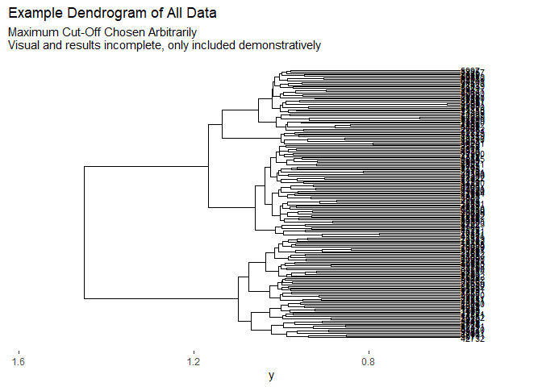<!-- -->


The above visualization is impossible to decipher, but (again solely for current presentation and familiaring myself with the treelet function's output structure), we can visualize the treelet for only the first 20 conjoinings/clusterings:


```r
# pick zposition of interest (i.e. cut-level) and take the covariance matrix from that level
  # tt_results$Zpos[1:20,]

# need to extract the numeric label to the actual diagnosis code
  labels_df <- cov2cor(tt_results$TreeCovs[[ncol(icd_cor)-1]]) %>% colnames() %>% data.frame(code = ., label=1:178)
  
  codes_mat <- tt_results$Zpos[1:20,] %>% as.data.frame() %>% 
    merge(labels_df, by.x="V1", by.y="label", all.x=T)  %>% 
    merge(labels_df, by.x="V2", by.y="label", all.x=T) %>% 
    select(CodeLab1=code.x, CodeLab2=code.y) %>% as.matrix()

  "X99592" %in% codes_mat
```

```
## [1] TRUE
```

```r
  dist_mat <- as.dist(
    1 - cov2cor(tt_results$TreeCovs[[ncol(icd_cor)-1]]) %>% .[colnames(.) %in% codes_mat,colnames(.) %in% codes_mat]
  )

dendr <- dendro_data(hclust(dist_mat), type="rectangle")

dendr$segments[segment(dendr)$yend==0, "yend"] <- min(segment(dendr)[segment(dendr)$yend>0, "yend"])*0.95
dendr$labels$y <- min(segment(dendr)[segment(dendr)$yend>0, "yend"])
dendr$labels$label <- stringr::str_replace(dendr$labels$label, "X", "")

ggplot() + 
  geom_segment(data=segment(dendr), aes(x=x, y=y, xend=xend, yend=yend)) + 
  geom_text(data=label(dendr), aes(x=x, y=y, label=label, hjust=0), size=3) +
  coord_flip() + scale_y_reverse(expand=c(0.2, 0)) + 
  theme(axis.line.y=element_blank(),
        axis.ticks.y=element_blank(),
        axis.text.y=element_blank(),
        axis.title.y=element_blank(),
        panel.background=element_rect(fill="white"))
```

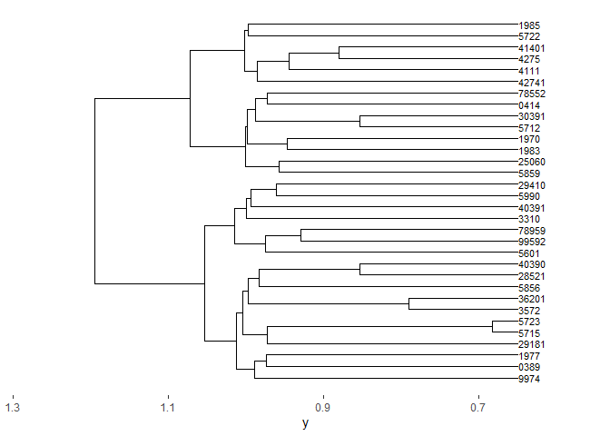<!-- -->


Trying to subset labels in the full dendrogram


```r
# compute correlation matrix
icd_cor <- cohort_full %>% select(starts_with("X")) %>% cor()

# run treelet
tt_results <- treelet::Run_JTree(icd_cor, nrow(icd_cor)-1, 1:nrow(icd_cor)-1)
```

```
## [1] 100
```

```r
# Converting the covariance matrix --> correlation matrix --> distance matrix
  # currently simply for the highest level of the covariance matrix
dist_mat <- as.dist(
  1-cov2cor(tt_results$TreeCovs[[nrow(icd_cor)-1]])
  )

# Making the result easily plotted in a dendrogram
  dendr <- dendro_data(hclust(dist_mat), type="rectangle")

# Modifying the axis position of the labels slightly to reduce length of the final visual
  dendr$segments[segment(dendr)$yend==0, "yend"] <- min(segment(dendr)[segment(dendr)$yend>0, "yend"])*0.95
  dendr$labels$y <- min(segment(dendr)[segment(dendr)$yend>0, "yend"])
  dendr$labels[!(dendr$labels$label %in% codes_mat), "label"] <- ""
  dendr$labels$label <- stringr::str_replace(dendr$labels$label, "X", "")

# Plot
  ggplot() + 
    geom_segment(data=segment(dendr), aes(x=x, y=y, xend=xend, yend=yend)) + 
    geom_text(data=label(dendr), aes(x=x, y=y, label=label, hjust=0), size=3) +
    coord_flip() + scale_y_reverse(expand=c(0.2, 0)) + 
    theme(axis.line.y=element_blank(),
          axis.ticks.y=element_blank(),
          axis.text.y=element_blank(),
          axis.title.y=element_blank(),
          panel.background=element_rect(fill="white")) +
    ggtitle("Example Dendrogram of All Data", subtitle = "Maximum Cut-Off Chosen Arbitrarily\nVisual and results incomplete, only included demonstratively")
```

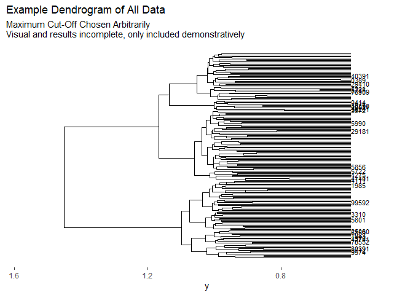<!-- -->


